# Manual de usuario — Barra

**Sistema de gestión de pedidos para locales gastronómicos**

| | |
|---|---|
| Versión del sistema | 1.0.0 (rama `development`, octubre 2026) |
| Dirigido a | Dueño/administrador del local, cajero/mostrador, mozo y cocina |
| Equipo | Sofía Power (Scrum Master), Mauro Beltrán, Lautaro Palombo, Thomas Barrera Fuentes |

> Este manual describe **lo que Barra hace hoy** en la rama `development`. Las funciones previstas
> que todavía no están disponibles se marcan con **«Esta versión»** y se resumen en la
> [sección 14](#14-limitaciones-de-esta-versión). Las capturas son de la aplicación real, con datos de ejemplo.

---

## Índice

1. [¿Qué es Barra?](#1-qué-es-barra)
2. [Requisitos del equipo](#2-requisitos-del-equipo)
3. [Cómo obtener Barra (web de venta)](#3-cómo-obtener-barra-web-de-venta)
4. [Instalación](#4-instalación)
5. [Abrir y cerrar Barra todos los días](#5-abrir-y-cerrar-barra-todos-los-días)
6. [Conociendo la pantalla](#6-conociendo-la-pantalla)
7. [Primer uso: configurar el local](#7-primer-uso-configurar-el-local)
8. [Uso diario](#8-uso-diario)
9. [Stock y alertas de stock bajo](#9-stock-y-alertas-de-stock-bajo)
10. [Reportes: el resumen diario de ventas](#10-reportes-el-resumen-diario-de-ventas)
11. [Si se corta internet](#11-si-se-corta-internet)
12. [Tus datos y las copias de seguridad](#12-tus-datos-y-las-copias-de-seguridad)
13. [Problemas frecuentes](#13-problemas-frecuentes)
14. [Limitaciones de esta versión](#14-limitaciones-de-esta-versión)
15. [Glosario](#15-glosario)

---

## 1. ¿Qué es Barra?

Barra es un sistema **interno** para el local: sirve para tomar pedidos, mandarlos a la cocina,
llevar la cuenta de las mesas, controlar el stock y recibir por email alertas y un resumen
diario de ventas. **No tiene ninguna función de cara al cliente final (comensal):** no le manda
avisos ni recibe pedidos online.

Barra funciona **en la computadora del local** y guarda todo ahí mismo, por eso sigue andando
aunque se corte internet (ver [sección 11](#11-si-se-corta-internet)).

### ¿Quién usa cada pantalla?

| Pantalla | Para qué sirve | Quién la usa |
|---|---|---|
| **Vender** | Pedidos de mostrador / para llevar (sin mesa) | Cajero |
| **Mesas** | Abrir la cuenta de una mesa, sumar rondas, cerrar y sacar el ticket | Mozo / cajero |
| **Cocina** | Ver qué hay que preparar y marcar pedidos como listos o entregados | Cocina |
| **Admin** | Productos y precios, stock, mesas del salón, datos del local, emails | Dueño / administrador |

> **Esta versión:** todas las pantallas funcionan en **la misma computadora**. Si la cocina
> tiene su propia pantalla, tiene que ser un segundo monitor de esa misma PC.

---

## 2. Requisitos del equipo

| Requisito | Detalle |
|---|---|
| Sistema operativo | Windows 10 u 11 de 64 bits |
| Java | Java 17 o más nuevo (lo pide la aplicación de escritorio, ver [4.2](#42-instalar-java-solo-la-primera-vez)) |
| Pantalla | Resolución mínima recomendada 1366 × 768 (la ventana de Barra necesita al menos 860 × 560) |
| Internet | Solo para descargar Barra y para mandar los emails. Para vender **no** hace falta |
| Impresora (opcional) | Cualquier impresora instalada en Windows, para imprimir tickets |
| Cuenta de email (opcional) | Una cuenta con acceso SMTP (por ejemplo Gmail) para recibir alertas y el resumen diario |

---

## 3. Cómo obtener Barra (web de venta)

Barra se consigue desde su página web. Ahí elegís un plan, dejás tu nombre y tu email, y te
llega un mail con tu licencia y el link de descarga.

### 3.1 Elegir un plan

En la página principal aparecen los planes. Tocá **Elegir plan** en el que quieras.

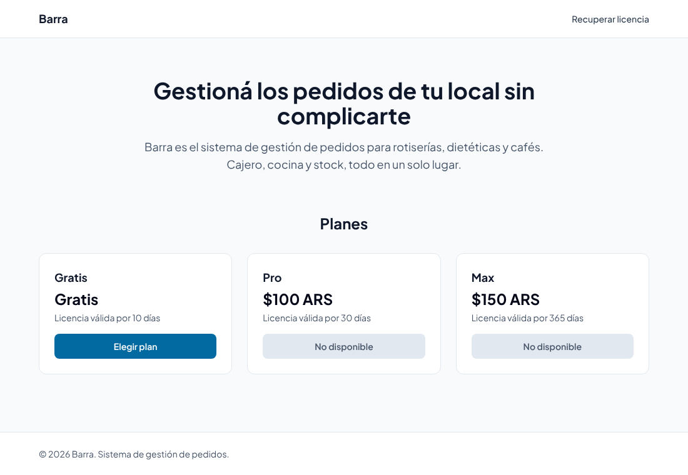

| Plan | Duración de la licencia | Estado actual |
|---|---|---|
| Gratis | 10 días | Disponible |
| Pro | 30 días | «No disponible» |
| Max | 365 días | «No disponible» |

> **Esta versión:** solo se puede obtener el plan **Gratis**. Los precios de Pro y Max que
> muestra la web son de prueba.

### 3.2 Completar tus datos

Escribí tu **nombre** y tu **email** y tocá **Continuar**. Usá un email que revises: ahí llega la licencia.

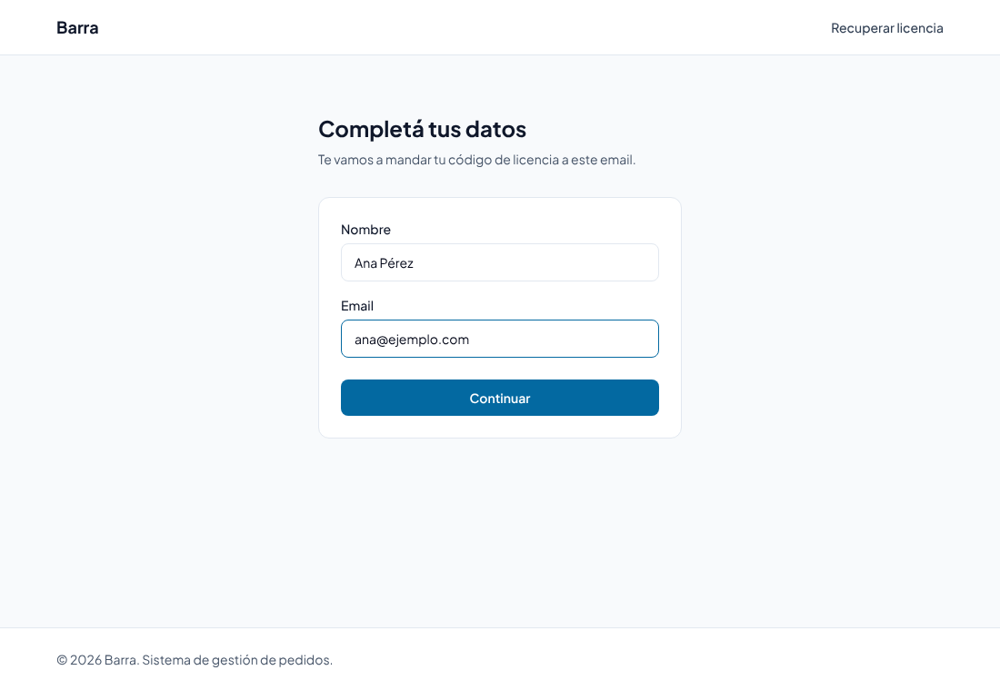

- **Plan Gratis:** no se paga nada; pasás directo a la pantalla «¡Listo!».
- **Planes pagos (cuando estén disponibles):** la web te lleva a **Mercado Pago** para pagar.
  Cuando el pago se aprueba, volvés a la pantalla «¡Listo!» y te llega el mail.

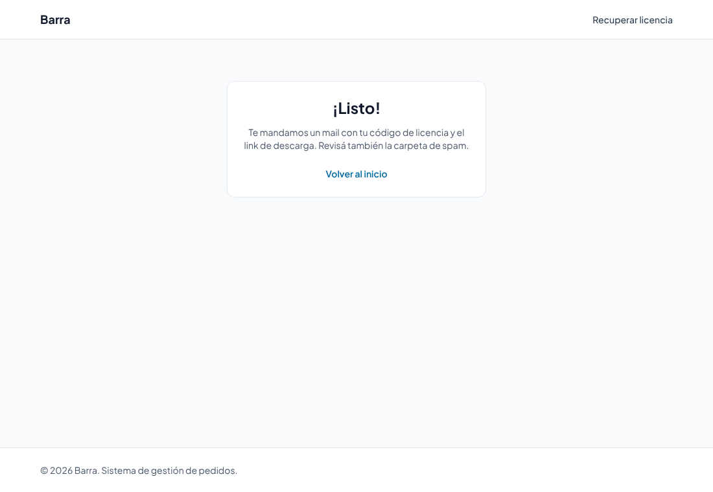

### 3.3 El mail con tu licencia

Te llega un mail con el asunto **«Tu licencia de Barra»** que trae:

- **Código de licencia**, con el formato `BARRA-XXXX-XXXX-XXXX`.
- **Clave secreta**, una cadena larga de letras y números.
- El **link de descarga** del programa.

**Guardá el código y la clave en un lugar seguro y no los compartas.** Si no ves el mail,
revisá la carpeta de spam.

> **Esta versión:** la aplicación de escritorio todavía **no pide** el código ni la clave al
> abrirse (la activación está en desarrollo). Guardalos igual: los vas a necesitar cuando la
> activación esté disponible.

### 3.4 Recuperar la licencia

Si perdiste el mail, entrá a **Recuperar licencia** (arriba a la derecha de la web), escribí el
email con el que compraste y tocá **Recuperar licencia**.

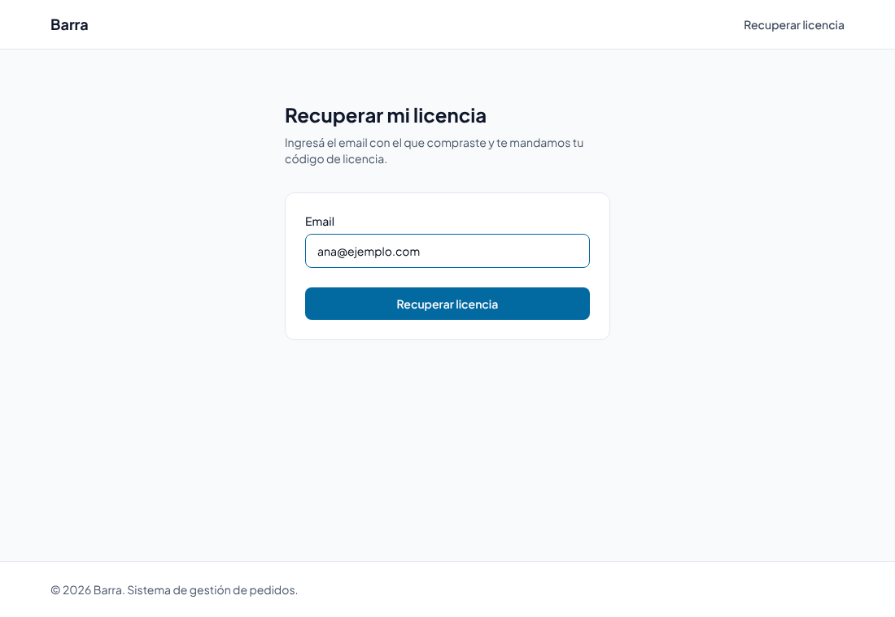

Te llega un mail con tu **código** de licencia. Por seguridad, **la clave secreta no se
reenvía**: si la perdiste, contactá al equipo de Barra.

---

## 4. Instalación

### 4.1 Descargar los archivos

Desde el link de descarga bajá estos **dos** archivos:

| Archivo | Qué es |
|---|---|
| `barra-backend-v1.0.0.exe` | El **servidor** de Barra: guarda los datos y hace el trabajo de fondo (stock, emails, copias de seguridad) |
| `barra-gui-v1.0.0.jar` | La **aplicación** con las pantallas Vender, Mesas, Cocina y Admin |

Creá una carpeta solo para Barra, por ejemplo `C:\Barra`, y mové ahí los dos archivos.
**No los dejes en «Descargas»:** en la carpeta del servidor se guardan todos los datos del local.

### 4.2 Instalar Java (solo la primera vez)

La aplicación necesita **Java 17 o más nuevo**. Si no lo tenés:

1. Descargá Java desde [adoptium.net](https://adoptium.net/) (versión «Temurin 17» o «Temurin 21», para Windows x64, instalador `.msi`).
2. Ejecutá el instalador y aceptá las opciones por defecto.

> **Esta versión:** el objetivo es que el instalador final ya incluya Java y no haya que
> instalar nada aparte. Por ahora, este paso es necesario.

### 4.3 Primer arranque

1. Hacé doble clic en **`barra-backend-v1.0.0.exe`**.
   - Si Windows muestra «Windows protegió su PC», tocá **Más información → Ejecutar de todas formas**.
   - Se abre una **ventana negra** (consola). Cuando aparece la línea
     `Uvicorn running on http://127.0.0.1:8000`, el servidor está listo.
   - **No cierres esa ventana** mientras uses Barra. Podés minimizarla.
2. Hacé doble clic en **`barra-gui-v1.0.0.jar`**. Se abre la ventana de Barra.
3. Abajo a la izquierda tiene que decir **● Backend conectado** (punto verde).

La primera vez, Barra arranca con datos de ejemplo para que puedas probar: tres productos
(Hamburguesa clásica, Papas fritas y Gaseosa 500ml), seis mesas (Mesa 1 a Mesa 6) y el nombre
de local «Mi local». Los cambiás en la [sección 7](#7-primer-uso-configurar-el-local).

Después del primer arranque, en `C:\Barra` vas a ver archivos nuevos que crea el servidor:

| Archivo/carpeta | Qué es | ¿Se puede borrar? |
|---|---|---|
| `barra.db` | La base de datos: productos, pedidos, mesas, configuración | **No.** Es toda la información del local |
| `barra_secret.key` | La clave con la que se protege la contraseña del email | **No.** Si se pierde, hay que volver a escribir la contraseña del email |
| `backups\` | Copias de seguridad automáticas de `barra.db` | No conviene (ver [sección 12](#12-tus-datos-y-las-copias-de-seguridad)) |

---

## 5. Abrir y cerrar Barra todos los días

**Para abrir**, siempre en este orden:

1. `barra-backend-v1.0.0.exe` (el servidor, ventana negra).
2. `barra-gui-v1.0.0.jar` (la aplicación).

Si abrís la aplicación primero, no pasa nada grave: va a decir **Backend caído** y se conecta
sola unos segundos después de que abras el servidor.

**Para cerrar:**

1. Cerrá la ventana de Barra.
2. Cerrá la ventana negra del servidor.

> **Importante:** las alertas de stock y el resumen diario por email los manda el servidor.
> Si cerrás la ventana negra, no se mandan hasta que la vuelvas a abrir.

> **Tip:** para no tener que buscarlos cada día, creá accesos directos de los dos archivos en
> el escritorio (clic derecho → *Enviar a* → *Escritorio (crear acceso directo)*).

---

## 6. Conociendo la pantalla

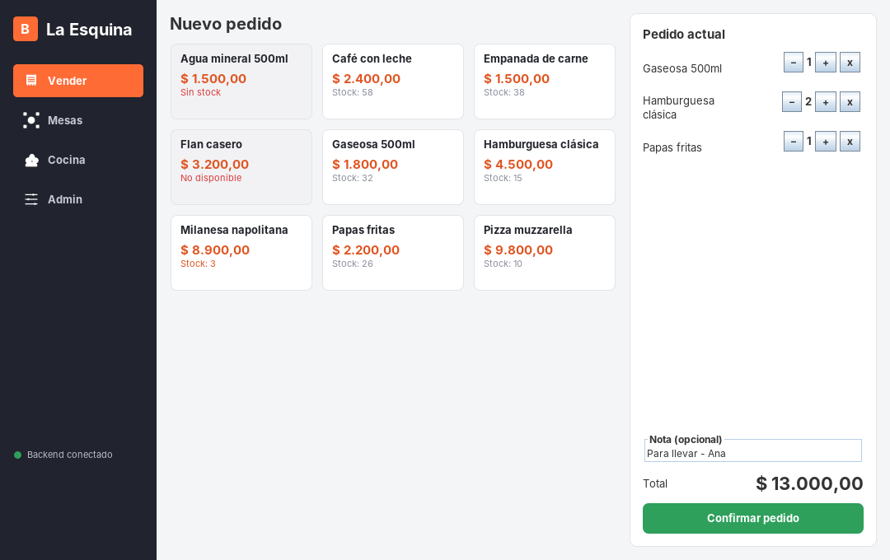

- **Barra lateral (izquierda):** arriba, el nombre de tu local. Debajo, los botones para ir a
  **Vender**, **Mesas**, **Cocina** y **Admin**. El botón de la pantalla en la que estás se ve en naranja.
- **Indicador de conexión (abajo a la izquierda):**
  - ● verde **Backend conectado**: todo funciona.
  - ● rojo **Backend caído**: la aplicación no encuentra al servidor (ver [sección 13](#13-problemas-frecuentes)).
    Mientras tanto, las pantallas no se actualizan y no se pueden guardar pedidos. Si abriste la
    aplicación sin el servidor, se ve así:

    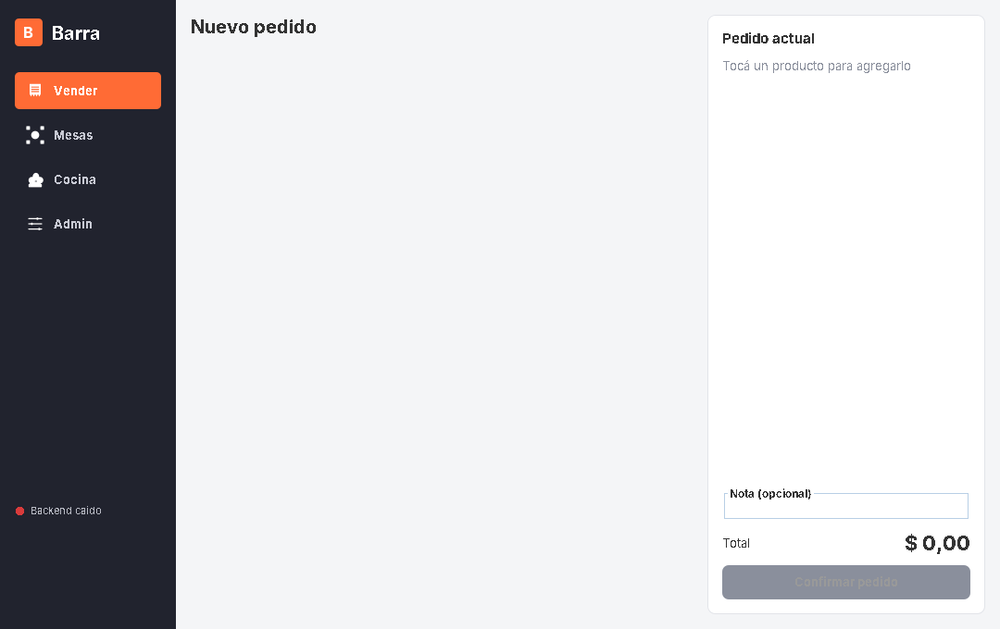
  - **Error al sincronizar**: hubo un problema puntual leyendo datos; suele resolverse solo.
- **Avisos:** cuando hacés algo, aparece un cartel arriba a la derecha que se va solo a los
  pocos segundos: **verde** si salió bien, **rojo** si hubo un problema (el cartel dice el motivo).
- **Actualización automática:** cada 4 segundos Barra actualiza todas las pantallas. Un pedido
  confirmado en Vender aparece en Cocina sin hacer nada.

---

## 7. Primer uso: configurar el local

Hacé esto una sola vez, antes de empezar a vender. Todo está en **Admin**.

**Lista de verificación:**

- [ ] Poner el nombre del local ([7.1](#71-nombre-del-local-y-datos-del-dueño))
- [ ] Cargar los datos del dueño ([7.1](#71-nombre-del-local-y-datos-del-dueño))
- [ ] Cargar los productos con precio y stock, y pausar los de ejemplo ([7.2](#72-productos))
- [ ] Armar las mesas del salón ([7.3](#73-mesas-del-salón))
- [ ] Configurar el email y probarlo ([7.4](#74-email-alertas-y-resumen-diario))

### 7.1 Nombre del local y datos del dueño

Entrá a **Admin → Configuración**.

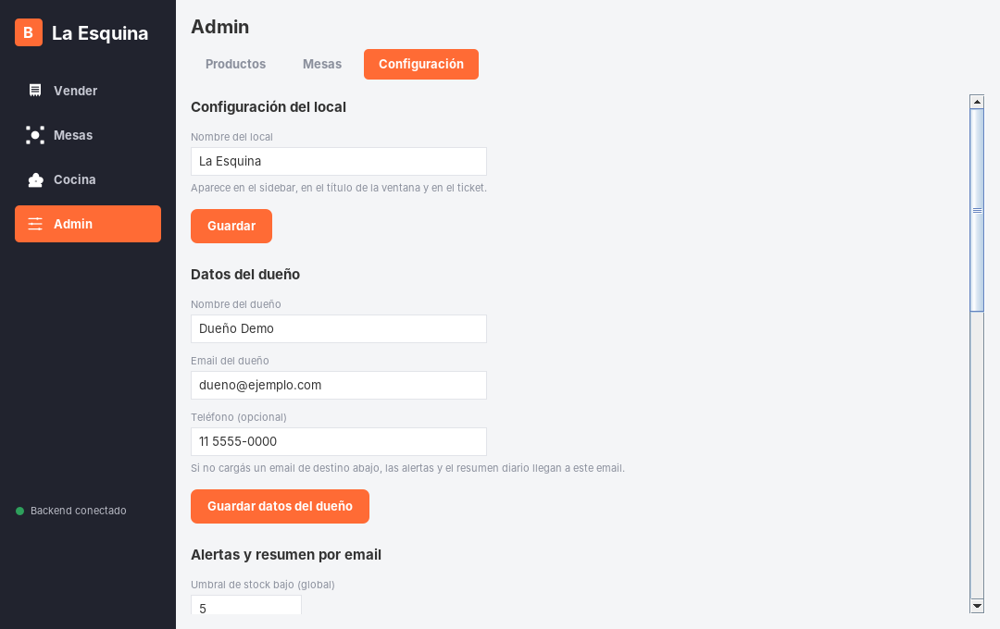

1. **Nombre del local:** escribilo y tocá **Guardar**. Aparece en la barra lateral, en el título
   de la ventana y en los tickets.
2. **Datos del dueño:** completá **Nombre del dueño**, **Email del dueño** y, si querés,
   **Teléfono**. Tocá **Guardar datos del dueño**.
   - Si más adelante no cargás un «email de destino», las alertas y el resumen diario llegan a
     este email.

### 7.2 Productos

Entrá a **Admin → Productos**. La tabla muestra todos los productos con su precio, stock,
umbral de stock bajo y si están disponibles para vender.

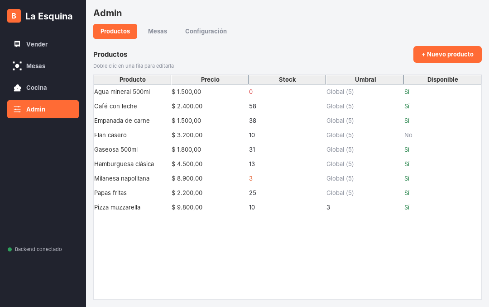

- El **stock** aparece en **rojo** si es 0 y en **naranja** si está por debajo del umbral.
- En **Umbral**, «Global (5)» significa que el producto usa el umbral general del local (ver [7.4](#74-email-alertas-y-resumen-diario)).

**Agregar un producto:**

1. Tocá **+ Nuevo producto**.
2. Completá el formulario:

   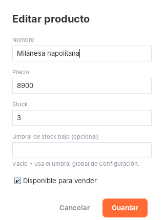

   | Campo | Qué poner |
   |---|---|
   | Nombre | Cómo se va a ver en Vender, en Cocina y en el ticket |
   | Precio | Mayor a 0. Podés usar coma o punto para los decimales (ej. `1500,50`) |
   | Stock | Cuántas unidades tenés (0 o más) |
   | Umbral de stock bajo (opcional) | Por debajo de este número, Barra avisa. Vacío = usa el umbral global |
   | Disponible para vender | Tildado = aparece para vender |

3. Tocá **Guardar**. Aparece el aviso verde «Producto … creado».

**Editar un producto (precio, stock, etc.):** hacé **doble clic** en su fila, cambiá lo que
necesites y tocá **Guardar**.

> **Reponer stock:** en el campo **Stock** escribí la **cantidad total** que queda después de
> reponer, no la cantidad que entró. Ejemplo: si quedaban 3 y entraron 20, escribí `23`.

**Pausar un producto** (por ejemplo, «hoy no hay flan»): editalo y destildá **Disponible para
vender**. Se sigue viendo en Vender pero en gris, como «No disponible», y no se puede pedir.
El stock no se pierde.

> **Esta versión:** los productos **no se pueden borrar**. Para los productos de ejemplo que no
> uses, editalos y cambiales el nombre y el precio para reutilizarlos, o destildá **Disponible
> para vender**.

### 7.3 Mesas del salón

Entrá a **Admin → Mesas**.

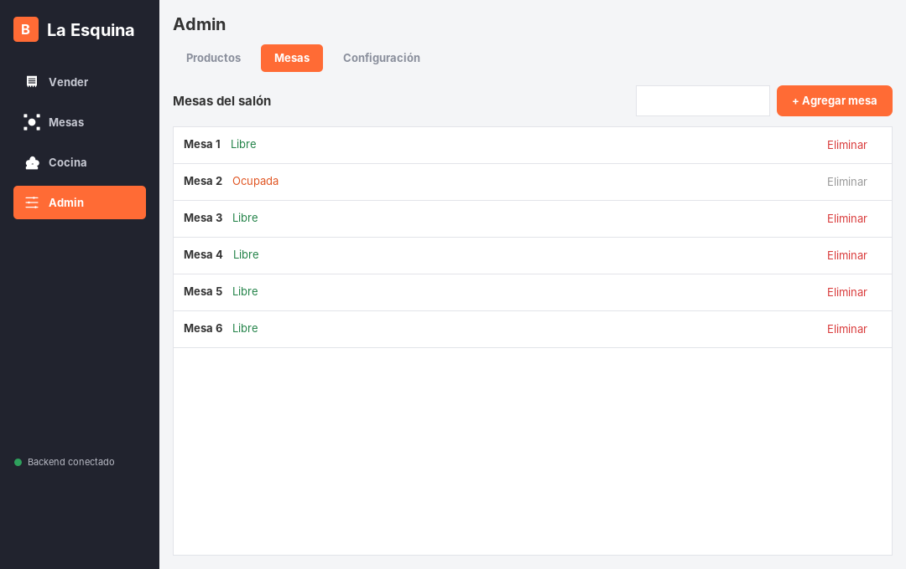

- **Agregar una mesa:** escribí el nombre en el cuadro de arriba a la derecha (ej. «Mesa 7»,
  «Barra 1», «Vereda 2») y tocá **+ Agregar mesa**.
- **Eliminar una mesa:** tocá **Eliminar** en su fila. Solo se puede con la mesa **libre**
  (si está ocupada, el botón aparece gris). **No pide confirmación.**

> **Esta versión:** una mesa que ya se usó alguna vez (que tuvo al menos una cuenta) no se puede
> eliminar: aparece un aviso rojo «No se pudo eliminar la mesa: Error del backend (500)…».
> Conviene armar bien las mesas **antes** de empezar a usarlas. Tampoco se les puede cambiar el
> nombre: hay que crear una nueva.

### 7.4 Email: alertas y resumen diario

En **Admin → Configuración**, bajá hasta **Alertas y resumen por email**.

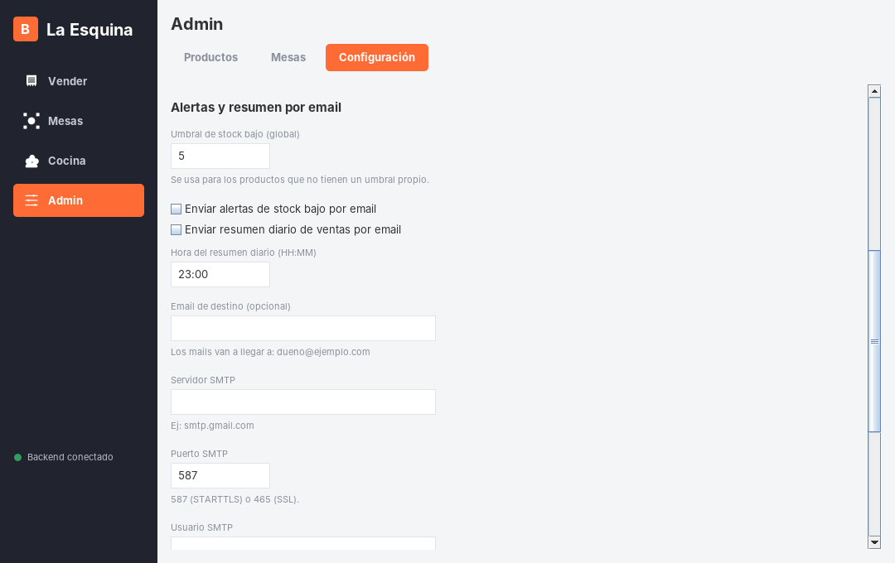

| Campo | Qué poner |
|---|---|
| Umbral de stock bajo (global) | Cantidad mínima para todos los productos que no tienen umbral propio. Por defecto, 5 |
| Enviar alertas de stock bajo por email | Tildalo para recibir un mail cuando un producto baja del umbral |
| Enviar resumen diario de ventas por email | Tildalo para recibir el resumen todos los días |
| Hora del resumen diario (HH:MM) | A qué hora llega el resumen. Ej.: `23:00`. Conviene poner la hora de cierre |
| Email de destino (opcional) | A dónde llegan los mails. Vacío = al email del dueño. Debajo dice «Los mails van a llegar a: …» |
| Servidor SMTP | El servidor de envío de tu email. Gmail: `smtp.gmail.com` |
| Puerto SMTP | `587` (lo más común) o `465` |
| Usuario SMTP | Normalmente, tu dirección de email completa |
| Contraseña SMTP | La contraseña para enviar mails (en Gmail, una «contraseña de aplicación», ver abajo) |

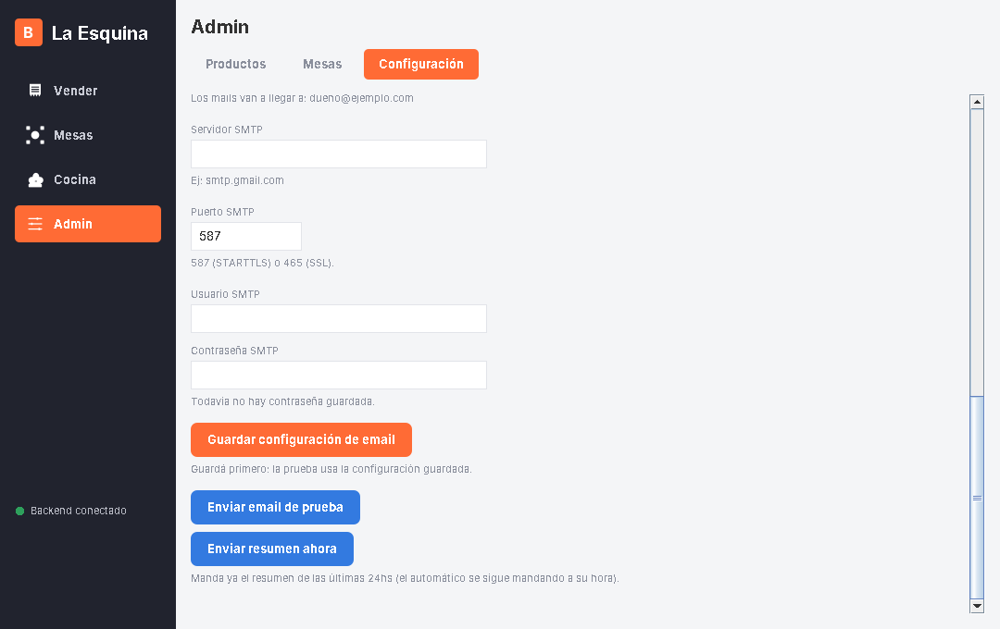

**Pasos:**

1. Completá los campos y tocá **Guardar configuración de email**.
2. Tocá **Enviar email de prueba**. Si sale bien, aparece «Email de prueba enviado a …» y te
   llega un mail con el asunto «[nombre del local] Email de prueba».
3. (Opcional) Tocá **Enviar resumen ahora** para ver cómo es el resumen sin esperar a la hora programada.

Para tener en cuenta:

- La prueba usa **la configuración guardada**: guardá antes de probar.
- La contraseña nunca se vuelve a mostrar. Debajo del campo dice «Ya hay una contraseña
  guardada»: si dejás el campo vacío, se mantiene la anterior.
- Si tildás una de las dos casillas de email y falta algún dato, Barra no deja guardar y te dice
  qué falta (ej. «Para habilitar el email hacen falta: smtp_host, smtp_usuario, smtp_password»).

**Si usás Gmail:** Gmail no acepta tu contraseña normal para esto. Necesitás una **contraseña
de aplicación**:

1. Activá la **verificación en dos pasos** en tu cuenta de Google.
2. En tu cuenta de Google buscá **«Contraseñas de aplicaciones»** y creá una (por ejemplo, con el nombre «Barra»).
3. Google te muestra una contraseña de 16 letras: esa es la que va en **Contraseña SMTP**.

Configuración típica de Gmail: servidor `smtp.gmail.com`, puerto `587`, usuario `tucuenta@gmail.com`.

> **Esta versión:** las alertas y el resumen llegan **solo por email**. El aviso por Telegram
> todavía no está disponible.

---

## 8. Uso diario

### 8.1 Tomar un pedido de mostrador (Vender)

Para pedidos para llevar o de mostrador, sin mesa.


1. Tocá **Vender** en la barra lateral.
2. **Tocá cada producto** que pide el cliente. Cada toque suma una unidad al **Pedido actual** (a la derecha).
   - Los productos en gris («Sin stock» o «No disponible») no se pueden tocar.
   - Debajo del precio se ve el stock. En naranja, quedan pocas unidades.
3. Ajustá las cantidades con **–** y **+**, o quitá un producto con **x**.
   No se puede pedir más que el stock que hay.
4. (Opcional) Escribí una **Nota**: «Para llevar – Ana», «sin cebolla», etc. La ve la cocina.
5. Revisá el **Total**: se calcula solo.
6. Tocá **Confirmar pedido**.

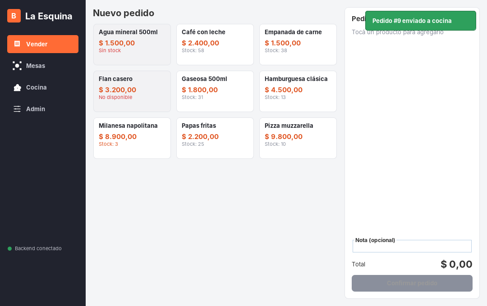

Aparece el aviso verde **«Pedido #N enviado a cocina»**. El pedido queda en la columna
**En preparación** de Cocina y el stock se descuenta en ese momento.

> **Esta versión:** un pedido confirmado **no se puede modificar ni cancelar** desde la
> aplicación. Revisá bien antes de confirmar.

### 8.2 Atender una mesa (Mesas)

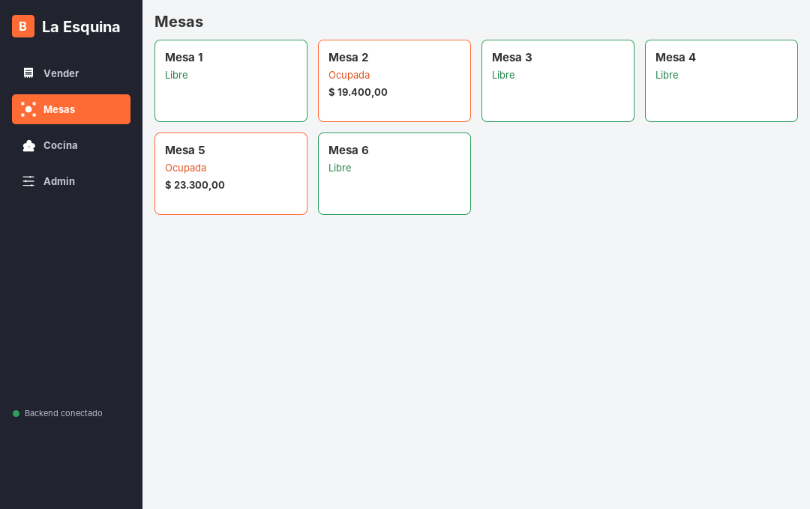

Cada tarjeta es una mesa:

- Borde **verde**, «**Libre**»: no tiene a nadie.
- Borde **naranja**, «**Ocupada**»: tiene la cuenta abierta. Debajo se ve el total acumulado.

**Abrir la mesa y tomar el pedido:**

1. Tocá la mesa. Si estaba libre, se abre su cuenta y pasa a «Ocupada».
2. Se abre la ventana de la mesa:

   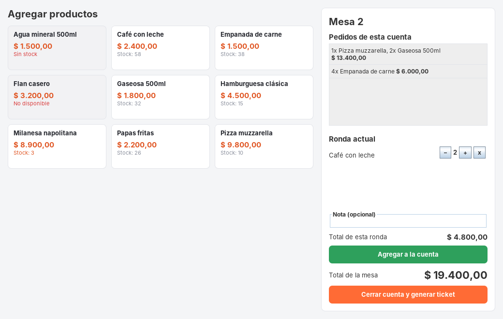

   - A la izquierda, los productos (igual que en Vender).
   - A la derecha, arriba: **Pedidos de esta cuenta** (todo lo que ya se pidió, ronda por ronda).
   - A la derecha, al medio: la **Ronda actual** (lo que estás cargando ahora).
3. Tocá los productos, ajustá con **–**, **+** y **x**, y agregá una nota si hace falta.
4. Tocá **Agregar a la cuenta**. La ronda pasa a «Pedidos de esta cuenta», se manda a la cocina
   (aparece como «Mesa N») y se descuenta el stock.
5. Podés cerrar la ventana de la mesa con la **X**: la cuenta sigue abierta.

**Sumar otra ronda más tarde:** tocá de nuevo la mesa (naranja), cargá los productos y tocá
**Agregar a la cuenta**. **Total de la mesa** muestra la suma de todas las rondas.

**Cobrar y cerrar la mesa:**

1. Abrí la mesa y verificá que la **Ronda actual** esté vacía. Si quedó algo cargado, Barra no
   deja cerrar («Confirmá o vaciá el carrito antes de cerrar la cuenta»).
2. Tocá **Cerrar cuenta y generar ticket**.
3. Aparece el **ticket** con todo lo consumido y el total:

   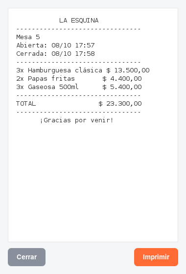

4. Tocá **Imprimir** para elegir la impresora, o **Cerrar** si no hace falta imprimirlo.
5. La mesa vuelve a estar **Libre**.

> Si abriste una mesa por error y no se pidió nada, abrila y tocá **Cerrar cuenta y generar
> ticket**: se libera sin generar ticket.

> **Esta versión:** el ticket **no es una factura** ni un comprobante fiscal. Barra tampoco
> registra la forma de pago.

### 8.3 Cocina: preparar y entregar

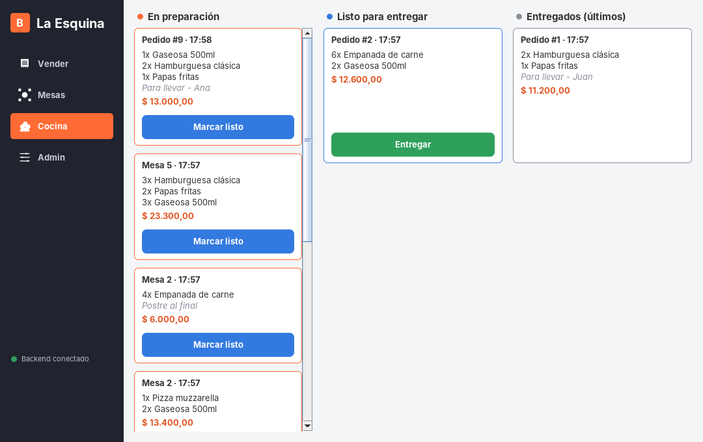

La pantalla tiene tres columnas:

| Columna | Qué hay | Botón |
|---|---|---|
| **En preparación** | Pedidos nuevos, a preparar | **Marcar listo** |
| **Listo para entregar** | Pedidos terminados que esperan al cliente o al mozo | **Entregar** |
| **Entregados (últimos)** | Los últimos 10 pedidos entregados | — |

Cada tarjeta muestra:

- **Pedido #N · hora** (mostrador) o **Mesa N · hora** (salón).
- Los productos con sus cantidades.
- La **nota**, en cursiva, si la tiene.
- El total.

**Uso:**

1. Cuando terminás de preparar un pedido, tocá **Marcar listo**: pasa a «Listo para entregar».
2. Cuando se entrega, tocá **Entregar**: pasa a «Entregados».

Los pedidos más nuevos aparecen **arriba** de cada columna.

> **Importante:** marcar «Entregar» un pedido de mesa **no cierra la mesa**. Para cobrar, se
> cierra la cuenta desde **Mesas** ([8.2](#82-atender-una-mesa-mesas)).

> **Esta versión:** el cambio de estado no se puede deshacer desde la pantalla. Tocá los botones con cuidado.

### 8.4 Consultar pedidos anteriores

- **Entregados (últimos)**, en Cocina: los últimos 10 pedidos entregados.
- **Pedidos de esta cuenta**, en la ventana de una mesa ocupada: todas sus rondas.
- **Resumen diario** por email: ventas y productos más vendidos del día ([sección 10](#10-reportes-el-resumen-diario-de-ventas)).

> **Esta versión:** todavía no hay una pantalla de **historial completo** con búsqueda por
> fecha. Todos los pedidos quedan guardados en la base de datos.

---

## 9. Stock y alertas de stock bajo

**Cómo se mueve el stock:**

- Se **descuenta** cuando se confirma un pedido de mostrador o se agrega una ronda a una mesa.
- Se **repone** a mano desde **Admin → Productos** (ver [7.2](#72-productos)).
- Si dos personas piden el último producto al mismo tiempo, Barra procesa los pedidos de a uno
  y rechaza el que ya no tiene stock: el stock nunca queda negativo.

**El umbral de stock bajo:**

- Cada producto puede tener **su propio umbral** (formulario del producto).
- Si no tiene, usa el **umbral global** de Admin → Configuración (por defecto, 5).
- Un producto está «bajo» cuando su stock es **menor** que el umbral (con umbral 5, avisa al quedar 4 o menos).

**La alerta por email** (si está tildado «Enviar alertas de stock bajo por email»):

- Barra revisa el stock cada 30 segundos.
- Cuando un producto baja del umbral, te llega **un** mail. Si bajan varios a la vez, van todos en el mismo mail.
- No te vuelve a avisar por ese producto hasta que lo **repongas por encima del umbral** y vuelva a bajar.
- Al activar la alerta por primera vez, llega un mail con todo lo que ya esté bajo en ese momento.

Ejemplo real del mail:

```text
Asunto: [La Esquina] Stock bajo en 2 productos

Los siguientes productos de La Esquina quedaron por debajo del umbral de stock:

  - Milanesa napolitana: quedan 3 (umbral: 5)
  - Agua mineral 500ml: quedan 0 (umbral: 5)

No vas a recibir otra alerta por estos productos hasta que se repongan
por encima del umbral y vuelvan a bajar.

-- Barra
```

> **Esta versión:** dentro de la aplicación no hay un cartel de alerta de stock. Lo más rápido
> para verlo es **Admin → Productos** (stock en naranja o rojo). En Vender y en las mesas, el
> stock se marca en naranja cuando quedan menos de 5 unidades, sin importar el umbral configurado.

---

## 10. Reportes: el resumen diario de ventas

El reporte de ventas de Barra es el **resumen diario por email**. Para activarlo, ver [7.4](#74-email-alertas-y-resumen-diario).

**Qué incluye:**

- Total vendido, cantidad de pedidos y ticket promedio.
- Cuánto se vendió en **mostrador** y cuánto en **mesas** (y cuántas cuentas se cerraron).
- **Productos más vendidos** (hasta 10, de mayor a menor).
- Los productos con **stock bajo** en ese momento.

**Qué período cubre:** las 24 horas anteriores a la hora configurada. Si el resumen está a las
`03:00`, un local que cierra de madrugada recibe toda la noche en un solo mail.

Ejemplo real del mail:

```text
Asunto: [La Esquina] Resumen de ventas del 08/10: $ 107.000,00

Resumen de ventas de La Esquina
Del 07/10 18:02 al 08/10 18:02

Total vendido:    $ 107.000,00
Pedidos:          9
Ticket promedio:  $ 11.888,89

  Mostrador: 6 pedidos - $ 64.300,00
  Mesas:     3 pedidos - $ 42.700,00 (1 cuentas cerradas)

Productos más vendidos:
  1. Empanada de carne x 10
  2. Gaseosa 500ml x 9
  3. Hamburguesa clásica x 7
  ...

Stock bajo en este momento:
  - Agua mineral 500ml: quedan 0 (umbral: 5)
  - Milanesa napolitana: quedan 3 (umbral: 5)

-- Barra
```

**Ver el resumen en cualquier momento:** en Admin → Configuración, tocá **Enviar resumen ahora**.
Te llega el resumen de las últimas 24 horas. Esto no reemplaza al automático, que se sigue
mandando a su hora.

**Si a la hora del resumen Barra estaba cerrado:** el resumen se manda apenas abras el servidor
ese mismo día. Si lo abrís otro día, esas ventas se suman al resumen siguiente (si pasaron más
de dos días, el resumen cubre solo las últimas 24 horas).

> **Esta versión:** todavía no hay una pantalla de **Reportes** dentro de la aplicación; el reporte llega por email.

---

## 11. Si se corta internet

- **Barra sigue funcionando:** podés vender, atender mesas, usar la cocina y editar productos.
  Todo se guarda en la computadora del local.
- **Lo único que se pausa son los emails.** Barra reintenta cada 5 minutos y los manda cuando vuelve la conexión:
  - Las **alertas de stock** pendientes se mandan apenas vuelve internet.
  - El **resumen diario** se manda con atraso.
- **Enviar email de prueba** y **Enviar resumen ahora** muestran un aviso rojo mientras no haya conexión.

---

## 12. Tus datos y las copias de seguridad

- Todos los datos están en el archivo **`barra.db`**, en la misma carpeta que `barra-backend-v1.0.0.exe`.
- Barra hace **copias de seguridad automáticas**:
  - al abrir el servidor, y después **cada 4 horas** mientras esté abierto;
  - en la carpeta **`backups\`**, con nombres como `barra_backup_20261008_175647.db` (año, mes, día, hora);
  - guarda las **5 más recientes** y borra las más viejas;
  - en `backups\backups.log` queda anotado cada copia hecha (o el error, si falló).
- Las copias quedan en **la misma computadora**. Para protegerte de una rotura del disco o de un
  robo, copiá de vez en cuando la carpeta `backups\` a un pendrive o a la nube.

**Restaurar una copia** (por ejemplo, si `barra.db` se dañó):

1. Cerrá la aplicación y la ventana negra del servidor.
2. Por las dudas, renombrá el `barra.db` actual a `barra.db.viejo`.
3. Copiá el backup que quieras desde `backups\` a la carpeta de Barra y renombralo a **`barra.db`**.
4. Abrí Barra de nuevo (servidor y aplicación).

Se pierden los movimientos hechos después de la hora de esa copia.

**Cambiar de computadora:** copiá a la nueva PC la carpeta completa de Barra (con `barra.db`,
`barra_secret.key` y `backups\`). Si no copiás `barra_secret.key`, todo funciona, pero tenés que
volver a escribir la **Contraseña SMTP** en Admin → Configuración.

---

## 13. Problemas frecuentes

| Problema | Causa probable | Solución |
|---|---|---|
| Abajo a la izquierda dice **● Backend caído** | El servidor no está abierto o se cerró la ventana negra | Abrí `barra-backend-v1.0.0.exe`. La aplicación se reconecta sola en unos segundos |
| La ventana negra del servidor se abre y se cierra enseguida | Otro programa usa el puerto 8000, o ya hay un servidor de Barra abierto | Fijate en la barra de tareas si ya hay otra ventana negra de Barra. Si no, reiniciá la PC y abrí Barra antes que otros programas |
| Al hacer doble clic en el `.jar` no pasa nada, o Windows pregunta con qué abrirlo | Java no está instalado o es anterior a la 17 | Instalá Java 17 o más nuevo ([4.2](#42-instalar-java-solo-la-primera-vez)) y probá de nuevo |
| «Windows protegió su PC» al abrir el `.exe` | El archivo no tiene firma digital | **Más información → Ejecutar de todas formas** |
| Aviso rojo con «Stock insuficiente para …» | Se quiso vender más de lo que hay | Revisá el stock en Admin → Productos. Si en realidad hay mercadería, actualizá el stock |
| Aviso rojo con «… no está disponible» | El producto está pausado | Admin → Productos → doble clic → tildá **Disponible para vender** |
| Un producto aparece gris y no se puede tocar | Stock 0 o producto no disponible | Reponé el stock o volvé a habilitarlo en Admin → Productos |
| «El servidor SMTP rechazó el usuario/contraseña (en Gmail hace falta una 'contraseña de aplicación')» | Contraseña equivocada, o en Gmail se usó la contraseña normal | Creá una contraseña de aplicación ([7.4](#74-email-alertas-y-resumen-diario)), pegala en **Contraseña SMTP**, guardá y probá de nuevo |
| «… no soporta STARTTLS … (probá con el puerto 465)» | El servidor de email no acepta el puerto 587 cifrado | Cambiá el **Puerto SMTP** a `465`, guardá y probá de nuevo |
| «Configuración de email incompleta, falta: …» | Falta un dato del email | Completá lo que indica el aviso y guardá |
| «No se pudo leer la contraseña SMTP» | Se perdió o cambió `barra_secret.key` | Volvé a escribir la **Contraseña SMTP** y guardá |
| No llegan las alertas de stock | La casilla no está tildada, el mail está en spam, ya se avisó de ese producto, o el servidor está cerrado | Revisá la casilla y el spam. Recordá que la alerta se repite solo después de reponer el producto por encima del umbral. El servidor tiene que estar abierto |
| Una mesa quedó «Ocupada» con $ 0,00 | Se abrió la mesa y no se pidió nada | Abrila y tocá **Cerrar cuenta y generar ticket** |
| No puedo eliminar una mesa | Está ocupada, o ya tuvo cuentas (limitación de esta versión) | Si está ocupada, cerrá su cuenta. Si ya se usó, por ahora no se puede eliminar |
| Me equivoqué en un pedido ya confirmado | Esta versión no permite modificar ni cancelar pedidos | Avisale a la cocina. Para corregir el stock, editalo en Admin → Productos |
| Perdí el código o la clave de la licencia | — | Usá **Recuperar licencia** en la web (solo reenvía el código). Para la clave secreta, contactá al equipo |

---

## 14. Limitaciones de esta versión

Funciones previstas en el proyecto que **todavía no están** en la versión 1.0.0 de `development`:

| Función prevista | Situación actual |
|---|---|
| Instalador único que no requiere Java | Son dos archivos separados y hay que instalar Java 17+ |
| La aplicación abre sola el servidor | Hay que abrir primero el servidor y después la aplicación |
| Activación de licencia al abrir la app y versión de prueba con vencimiento | La web emite la licencia, pero la app no la pide ni la controla |
| Pantalla de Reportes (ventas del día, producto más vendido) | Solo por email (resumen diario y «Enviar resumen ahora») |
| Historial completo de pedidos | Solo los últimos 10 entregados en Cocina |
| Modificar o cancelar un pedido | No disponible |
| Alertas por Telegram | Solo email |
| Cartel de stock bajo dentro de la app | Solo colores en Admin → Productos |
| Borrar productos, renombrar mesas | No disponible (se puede pausar un producto) |
| Cocina en otra computadora | Todo tiene que correr en la misma PC |
| Botón de descarga en la web | La descarga se hace desde el link del mail de licencia |

---

## 15. Glosario

| Término | Significado |
|---|---|
| **Servidor / backend** | El programa `barra-backend-v1.0.0.exe` (ventana negra). Guarda los datos y manda los emails |
| **Aplicación** | El programa `barra-gui-v1.0.0.jar`, con las pantallas Vender, Mesas, Cocina y Admin |
| **Cuenta (de mesa)** | Todo lo que se va pidiendo en una mesa desde que se abre hasta que se cierra |
| **Ronda** | Cada tanda de productos que se agrega a la cuenta de una mesa |
| **Umbral de stock** | Cantidad mínima: si el stock queda por debajo, Barra avisa |
| **SMTP** | El servicio de envío de mails de tu proveedor de email (Gmail, etc.) |
| **Contraseña de aplicación** | Contraseña especial que da Gmail para que un programa pueda mandar mails con tu cuenta |
| **Backup** | Copia de seguridad de la base de datos `barra.db` |
| **Licencia** | Código + clave secreta que te llegan por mail al obtener Barra desde la web |
