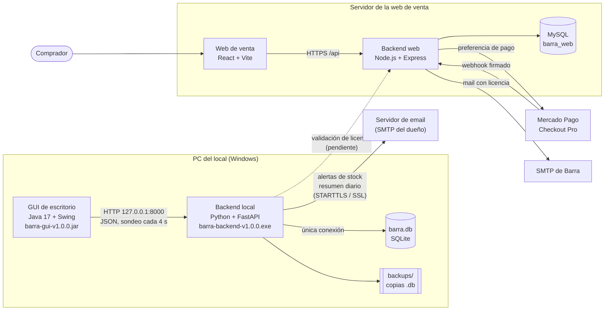
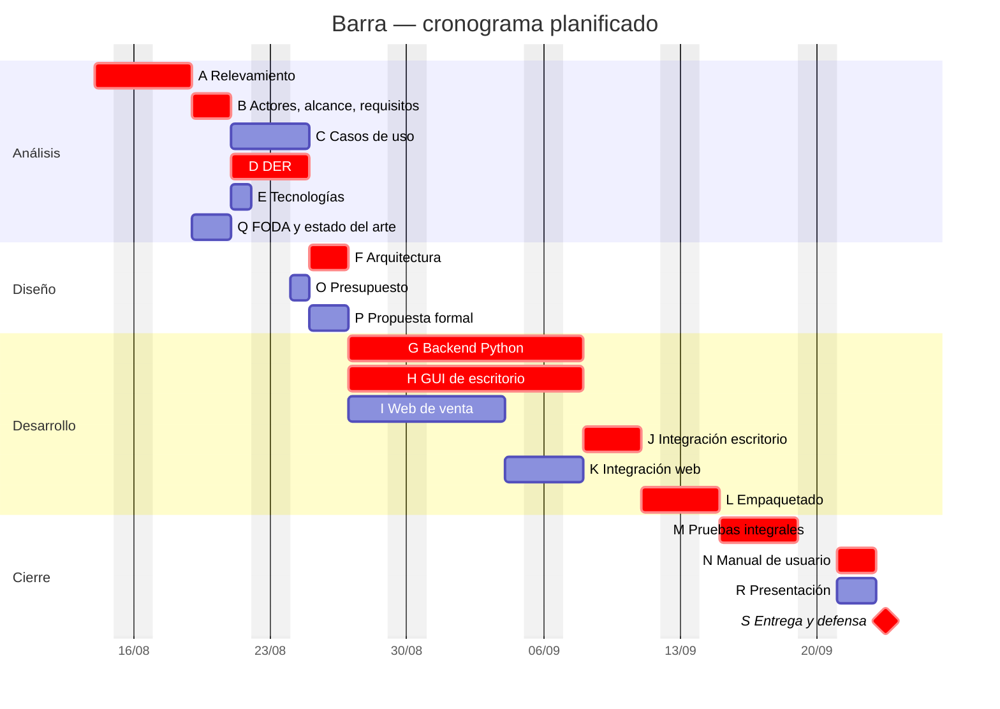
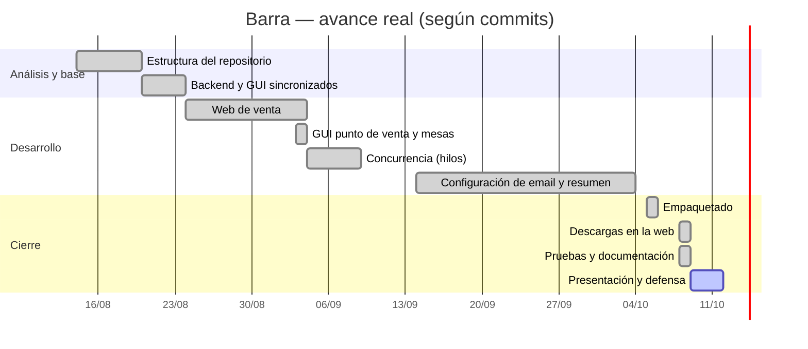
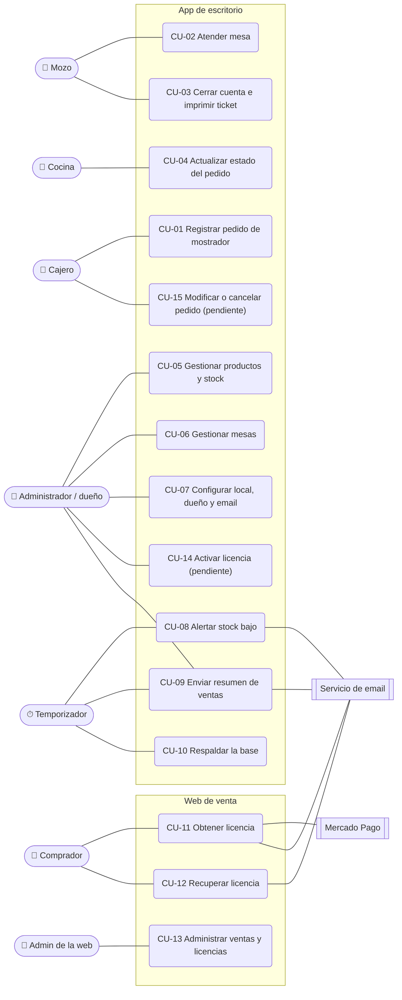
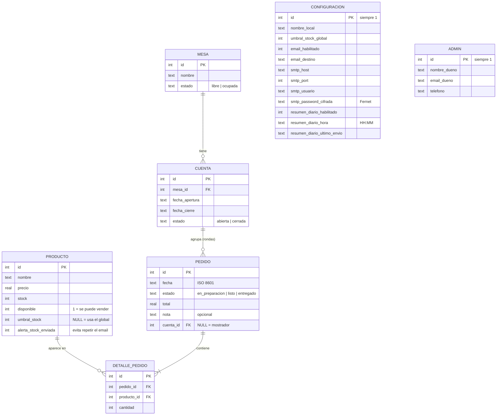
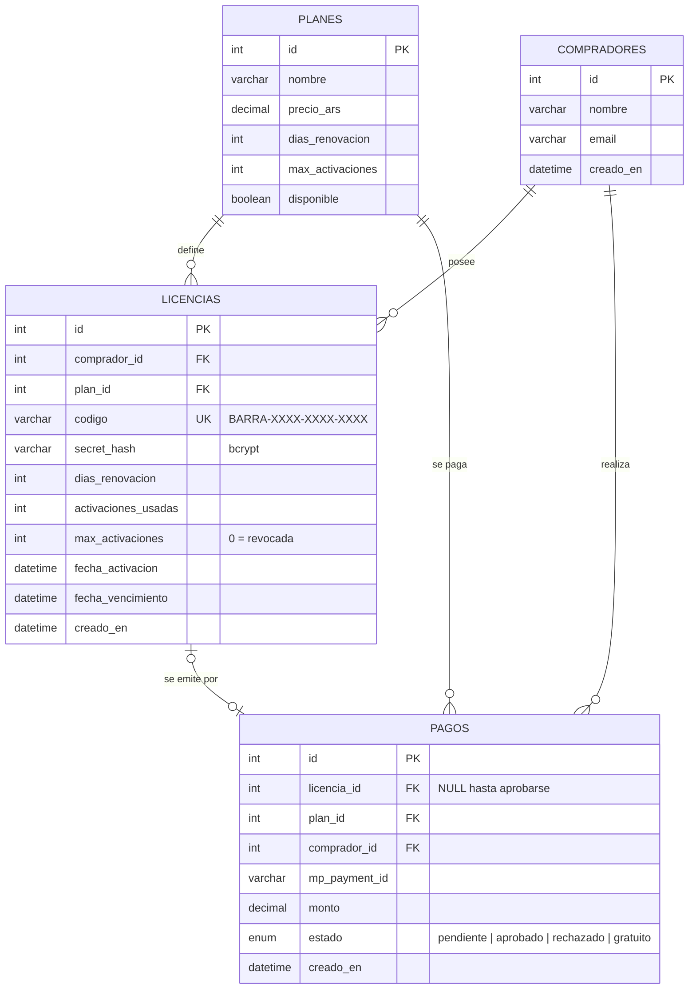

# Sistema de Pedidos «Barra» — Documento del proyecto

| | |
|---|---|
| Materia | Programación sobre Redes |
| Grupo | 1 |
| Integrantes | Sofía Power (Scrum Master), Mauro Beltrán, Lautaro Palombo, Thomas Barrera Fuentes |
| Versión del documento | 2.0 — 8 de octubre de 2026 |
| Versión del sistema | 1.0.0 (rama `development`, commit `8a4c21a`) |

> **Qué cambia respecto de la versión 1 del documento.** Esta versión reemplaza al documento de
> referencia original y lo alinea con lo que realmente se construyó. Se unificó la tecnología de
> la GUI (Java Swing), se agregaron mesas, cuentas, ticket y configuración de email a los
> requisitos, al DER y a los casos de uso, los requisitos ahora tienen identificadores y
> trazabilidad, y cada entregable tiene su documento completo. El detalle de lo corregido está en
> [`docs/revision-documentacion.md`](../revision-documentacion.md).

**Alcance clave:** es un sistema de gestión **interno**, solamente para el dueño del local y su
personal (cajero, mozo, cocina, administración). No hay ningún componente ni comunicación dirigida
al cliente final (comensal).

---

## Índice

1. [Arquitectura](#1-arquitectura)
2. [Presentación del producto](#2-presentación-del-producto)
3. [Manual de usuario](#3-manual-de-usuario)
4. [Presupuesto inicial](#4-presupuesto-inicial)
5. [Propuesta formal al cliente](#5-propuesta-formal-al-cliente)
6. [Entrevistas y encuestas](#6-entrevistas-y-encuestas)
7. [Análisis del sistema actual](#7-análisis-del-sistema-actual)
8. [Identificación de actores](#8-identificación-de-actores)
9. [Requisitos funcionales y no funcionales](#9-requisitos-funcionales-y-no-funcionales)
10. [Análisis FODA](#10-análisis-foda)
11. [Diagrama de Gantt](#11-diagrama-de-gantt)
12. [Casos de uso](#12-casos-de-uso)
13. [Definición del alcance](#13-definición-del-alcance)
14. [Estado del arte](#14-estado-del-arte)
15. [Propuesta de solución](#15-propuesta-de-solución)
16. [DER](#16-der)
17. [Elección y justificación de tecnologías](#17-elección-y-justificación-de-tecnologías)
18. [Roles de Scrum y organización del trabajo](#18-roles-de-scrum-y-organización-del-trabajo)
19. [Estructura del código](#19-estructura-del-código)
20. [Cómo levantar el sistema en desarrollo](#20-cómo-levantar-el-sistema-en-desarrollo)
- [Anexo: fuentes](#anexo-fuentes)

---

## 1. Arquitectura

Barra tiene dos sistemas independientes:

- **La aplicación de escritorio**, que usa el local todos los días. Funciona sin internet.
- **La web de venta**, donde el dueño de un local compra la licencia. Vive en un servidor.



### 1.1 Componentes

| Componente | Carpeta | Tecnología | Dónde corre | Responsabilidad |
|---|---|---|---|---|
| GUI de escritorio | `application/barra-gui` | Java 17, Swing, Maven | PC del local | Pantallas Vender, Mesas, Cocina y Admin. No toca la base: todo pasa por HTTP (`ApiClient.java`) |
| Backend local | `application/barra-backend` | Python, FastAPI, uvicorn | PC del local | Lógica de negocio, validaciones, hilos de concurrencia, emails. **Único dueño de `barra.db`** |
| Base local | `barra.db` | SQLite | PC del local | Productos, pedidos, mesas, cuentas, configuración |
| Web de venta | `barraPagina/barraWeb` | React 18, Vite, Tailwind, React Router | Navegador | Planes, checkout, resultado del pago, recuperar licencia, panel de administración |
| Backend web | `barraPagina/barraWebBackend` | Node.js, Express | Servidor | Compras, emisión y validación de licencias, webhook de Mercado Pago, panel de administración |
| Base web | — | MySQL | Servidor | Planes, compradores, licencias, pagos |

### 1.2 Cómo se comunican

- La GUI le habla al backend Python por **HTTP local** (`http://127.0.0.1:8000`), como un mozo que
  le pasa el pedido a la cocina por una ventanita y espera el plato listo.
- La GUI consulta el estado completo cada **4 segundos** (sondeo) y, además, se refresca al
  instante después de cada acción propia. Así, Vender, Mesas y Cocina se ven sincronizadas.
- **Python es el único dueño del archivo SQLite.** La GUI ni siquiera sabe que existe. Esto evita
  que dos procesos escriban el mismo archivo a la vez.
- El backend escucha solo en `127.0.0.1`: no queda expuesto a la red. Como consecuencia, en esta
  versión todas las pantallas tienen que correr en la misma PC.

### 1.3 Concurrencia en el backend local

| # | Hilo | Tipo | Qué hace |
|---|---|---|---|
| 1 | `pedido-worker` (×4) | `ThreadPoolExecutor` | Procesa los pedidos de mostrador (`POST /pedidos`) que llegan al mismo tiempo. Hasta 4 en paralelo; el resto espera en la cola |
| 2 | `stock-watcher` | `threading.Thread` daemon | Cada 30 s compara el stock con el umbral (del producto o global). Mantiene el listado de `GET /alertas` y manda **un** email por cada cruce del umbral |
| 3 | `db-backup` | `threading.Thread` daemon | Al arrancar y cada 4 h copia `barra.db` con la API nativa de backup de SQLite. Guarda las 5 copias más nuevas y registra cada copia en `backups.log` |
| 4 | `resumen-diario` | `threading.Thread` daemon | Cada 30 s revisa si llegó la hora del resumen; si ese día no se mandó, lo arma y lo envía por email |

- **`write_lock`** protege la conexión SQLite compartida: la sección crítica «leer stock →
  validar → descontar» es atómica, por eso dos pedidos simultáneos nunca venden la misma unidad
  (ver prueba CP-32 en el [plan de pruebas](plan-de-pruebas.md)).
- **`_alertas_lock`** protege el listado de alertas en memoria, separado del anterior para que
  consultar `/alertas` no compita con los pedidos.
- Los hilos 2 a 4 se detienen con un `threading.Event`: al cerrar la app, cortan la espera al instante.
- Las conexiones SMTP, que pueden tardar varios segundos, se hacen **fuera** de `write_lock`.
- Los usos de concurrencia son distintos entre sí: el pool atiende pedidos; los otros tres hilos
  son tareas de fondo (vigilancia, respaldo y reporte).

### 1.4 Conexiones externas

| Conexión | Desde | Hacia | Estado |
|---|---|---|---|
| Alertas de stock bajo y resumen diario al dueño | Backend local | Servidor SMTP del dueño (ej. Gmail) | Implementado (solo email) |
| Envío de la licencia y recuperación del código | Backend web | Servidor SMTP de Barra | Implementado |
| Cobro de planes pagos | Web de venta | Mercado Pago (Checkout Pro + webhook firmado) | Implementado; probado sin credenciales reales |
| Validación de licencia al abrir la app | Backend local | Backend web (`/api/licencias/activar` y `/estado`) | **Pendiente**: el endpoint existe, la app todavía no lo consume |

### 1.5 Empaquetado

| | Hoy (v1.0.0) | Objetivo |
|---|---|---|
| Backend | `barra-backend-v1.0.0.exe`, generado con PyInstaller `--onefile`. No requiere instalar Python | Igual |
| GUI | `barra-gui-v1.0.0.jar`, generado con Maven. **Requiere Java 17 o superior** | Instalador con `jpackage` que incluya el runtime de Java |
| Arranque | Se abren los dos archivos por separado, primero el backend | La GUI lanza el backend como subproceso |
| Distribución | Link de descarga en el mail de licencia; archivos en `barraWeb/public/downloads/` | Botón de descarga en la web |

Detalle en [`docs/tecnico/compilacion-y-empaquetado.md`](../tecnico/compilacion-y-empaquetado.md).

---

## 2. Presentación del producto

Formato: demo en vivo + 8 diapositivas de apoyo, unos 10 minutos.

| Material | Dónde |
|---|---|
| Diapositivas con notas del orador | <https://claude.ai/artifact/EkahGqhX72yFt5kYGBiied> (se descargan como PowerPoint o PDF) |
| Video de respaldo (1 min 31 s) | [`docs/presentacion/demo-barra.mp4`](../presentacion/demo-barra.mp4) |
| Guion cronometrado, demo paso a paso y preguntas probables | [`presentacion.md`](presentacion.md) |

**Guion de la demo (actualizado a lo que existe):**

1. **El problema (30 s):** pedidos que se pisan, sin registro de ventas, sin control de stock.
2. **Demo real:** cargar un pedido en Vender → verlo en Cocina → marcarlo listo → atender una mesa
   y sacar el ticket → mostrar el mail de alerta de stock bajo que le llega al dueño.
3. **Reportes:** mostrar el mail del resumen diario (botón «Enviar resumen ahora»). No hay pantalla de reportes en esta versión.
4. **Instalación:** los dos archivos y el arranque. Mostrar que no hace falta instalar Python ni una base de datos.
5. **Cómo se compra:** la web, el plan Gratis y el mail con la licencia.

---

## 3. Manual de usuario

Completo, con capturas reales: [`docs/manual-de-usuario.md`](../manual-de-usuario.md).
Cubre instalación, primer uso, uso diario, reportes, funcionamiento sin internet, copias de
seguridad, problemas frecuentes y limitaciones de esta versión.

---

## 4. Presupuesto inicial

Completo en [`presupuesto.md`](presupuesto.md). Resumen:

| Concepto | Monto |
|---|---|
| Desarrollo (268 h × $7.000 + 10 % de contingencia) | $2.063.600 (único) |
| Infraestructura (servidor, backups, dominio) | ≈ $15.250 por mes |
| Comisión de Mercado Pago (tarjeta, acreditación inmediata) | ≈ 7,85 % de cada venta paga |
| Precio de venta propuesto | Pro $12.000 / 30 días · Max $120.000 / 365 días · Gratis 10 días |
| Recupero del desarrollo | ≈ 10 meses con 20 locales en plan Pro |

---

## 5. Propuesta formal al cliente

Completa en [`propuesta-formal.md`](propuesta-formal.md): portada, resumen ejecutivo, problema,
solución, alcance, cronograma, presupuesto y condiciones de soporte.

---

## 6. Entrevistas y encuestas

Instrumentos listos para usar (guía de entrevista, encuesta, planillas de registro y método de
análisis) en [`entrevistas-y-encuestas.md`](entrevistas-y-encuestas.md).

> Los resultados se completan con las respuestas reales de los locales relevados: no se
> inventan datos de entrevistas.

---

## 7. Análisis del sistema actual

Así trabaja hoy un local chico sin sistema. Cada «dolor» tiene un identificador para seguirlo
hasta los requisitos que lo resuelven.

| ID | Dolor del sistema actual | Requisitos que lo resuelven |
|---|---|---|
| D1 | Los pedidos se anotan a mano o se dictan de viva voz a la cocina, y se pierden o se confunden | RF01, RF03, RF04, RF09 |
| D2 | No hay registro digital de qué se vendió cada día | RF01, RF07, RF12 |
| D3 | No hay control de stock, o se lleva a mano y desactualizado | RF05, RF06, RF08 |
| D4 | El cobro no está conectado con lo que se preparó | RF02, RF09 |
| D5 | No hay datos históricos para decidir (qué producto reforzar, cuándo sumar personal) | RF07, RF12, RF22 (pendiente) |
| D6 | Si se rompe la PC o se borra la planilla, se pierde todo | RF13 |
| — | Cómo se avisa al comensal que su pedido está listo | **Fuera del alcance:** se sigue haciendo como hoy, de forma manual |

---

## 8. Identificación de actores

| Actor | Tipo | Qué hace |
|---|---|---|
| Cajero / mostrador | Primario | Carga pedidos para llevar o de mostrador |
| Mozo / salón | Primario | Abre la cuenta de una mesa, suma rondas, cierra la cuenta y entrega el ticket |
| Cocina | Primario | Ve la cola de pedidos y los marca como listos y entregados |
| Administrador / dueño del local | Primario | Gestiona productos, stock, mesas y configuración; recibe alertas y el resumen diario |
| Comprador del software | Primario (web) | Dueño de un local que obtiene la licencia en la web |
| Administrador de la web | Primario (web) | Equipo de Barra: consulta ventas y licencias, y revoca licencias |
| Temporizador del sistema | Secundario | Dispara las tareas de fondo: vigilancia de stock, backup y resumen diario |
| Servicio de email (SMTP) | Externo | Entrega las alertas, el resumen diario y los mails de licencia |
| Servicio de licencias | Externo | Backend de la web: emite, activa y valida licencias |
| Pasarela de pago | Externo | Mercado Pago: cobra los planes pagos y notifica por webhook |

---

## 9. Requisitos funcionales y no funcionales

Prioridad según MoSCoW: **M** (debe), **S** (debería), **C** (podría), **W** (no en esta versión).
Las pruebas citadas están en el [plan de pruebas](plan-de-pruebas.md) y los casos de uso en
[`casos-de-uso.md`](casos-de-uso.md).

### 9.1 Requisitos funcionales

| ID | Requisito | Prior. | Estado | Caso de uso | Pruebas |
|---|---|---|---|---|---|
| RF01 | Registrar un pedido de mostrador con productos, cantidades y una nota opcional | M | Implementado | CU-01 | CP-08, CP-10 |
| RF02 | Calcular el total del pedido automáticamente | M | Implementado | CU-01, CU-02 | CP-08, CP-13 |
| RF03 | Cambiar el estado del pedido: en preparación → listo → entregado | M | Implementado | CU-04 | CP-11 |
| RF04 | Mostrar el estado de cada pedido, visible para el cajero y la cocina | M | Implementado (misma PC) | CU-04 | CP-12, CG-05 |
| RF05 | Descontar el stock al confirmar un pedido y rechazar pedidos sin stock o de productos no disponibles | M | Implementado | CU-01, CU-02 | CP-06, CP-08, CP-09 |
| RF06 | Avisar al dueño por email cuando el stock de un producto queda por debajo de su umbral (propio o global), una sola vez por cruce | M | Implementado (solo email) | CU-08 | CP-25, CP-26, CP-27 |
| RF07 | Generar un reporte de ventas del período: total, pedidos, ticket promedio, mostrador/mesas y productos más vendidos | M | Implementado (por email) | CU-09 | CP-28, CP-29 |
| RF08 | Alta, modificación y baja lógica (pausar) de productos del catálogo | M | Implementado (sin borrado físico) | CU-05 | CP-03 a CP-07 |
| RF09 | Gestionar mesas y cuentas: alta y baja de mesas, abrir cuenta, sumar rondas, cerrar e imprimir el ticket | S | Implementado (con un defecto, ver CP-17) | CU-02, CU-03, CU-06 | CP-13 a CP-17 |
| RF10 | Configurar el nombre del local y los datos del dueño | M | Implementado | CU-07 | CP-18, CP-19 |
| RF11 | Configurar el email (SMTP) con validación y envío de un email de prueba | M | Implementado | CU-07 | CP-20 a CP-24 |
| RF12 | Enviar automáticamente el resumen diario a la hora configurada | S | Implementado | CU-09 | CP-30 |
| RF13 | Respaldar la base de datos automáticamente, sin depender de la red | S | Implementado | CU-10 | CP-02 |
| RF14 | Ofrecer los planes en la web y procesar la compra (gratis directa; pagos por Mercado Pago) | M | Implementado | CU-11 | CW-01 a CW-04 |
| RF15 | Activar una licencia con código y clave secreta, respetando el máximo de activaciones | M | Implementado en la web | CU-14 | CW-06 a CW-09 |
| RF16 | Consultar el estado y el vencimiento de una licencia | S | Implementado en la web | CU-14 | CW-10 |
| RF17 | Recuperar el código de licencia por email | S | Implementado | CU-12 | CW-11 |
| RF18 | Consultar ventas y licencias y revocar licencias desde un panel protegido | S | Implementado | CU-13 | CW-12 a CW-15 |
| RF19 | Procesar las notificaciones de pago de Mercado Pago verificando su firma | M | Implementado | CU-11 | CW-16, CW-17 |
| RF20 | Pedir la licencia al abrir la app de escritorio y bloquearla al vencer la prueba | S | **Pendiente** | CU-14 | — |
| RF21 | Modificar o cancelar un pedido ya confirmado | S | **Pendiente** | CU-15 | — |
| RF22 | Consultar el historial de pedidos y los reportes desde una pantalla de la app | C | **Pendiente** | — | — |
| RF23 | Enviar las alertas por Telegram | W | Fuera de esta versión | — | — |

### 9.2 Requisitos no funcionales

| ID | Requisito | Cómo se mide | Estado | Pruebas |
|---|---|---|---|---|
| RNF01 | Responder a las acciones del usuario en menos de 1 segundo | Tiempo de respuesta del backend en 150 solicitudes (100 consultas y 50 pedidos) | Cumple (máximo 7,5 ms) | CP-31 |
| RNF02 | Seguir funcionando sin internet; solo se pausan los emails, que se reintentan cada 5 minutos | Vender con el servidor de mail inaccesible | Cumple | CP-33 |
| RNF03 | Los datos persisten localmente, sin depender de un servidor externo | Reiniciar el backend y comparar datos | Cumple | CP-01, CP-34 |
| RNF04 | La instalación no requiere conocimientos técnicos | Instalar siguiendo el manual sin ayuda | **No cumple todavía**: hay que instalar Java y abrir dos programas | — |
| RNF05 | Los pedidos concurrentes se procesan sin pérdida ni duplicación | 30 pedidos simultáneos sobre un stock de 10 | Cumple | CP-32 |
| RNF06 | El código separa presentación (GUI), lógica y datos en capas | Inspección: la GUI solo usa HTTP; solo `database.py` abre SQLite | Cumple | Inspección |
| RNF07 | Las credenciales se protegen: contraseña SMTP cifrada (Fernet), clave de licencia con hash (bcrypt), panel admin con autenticación, webhook con firma | Inspección de la base y pruebas de acceso | Cumple | CP-24, CW-05, CW-12, CW-13, CW-16 |
| RNF08 | Los respaldos no dependen de la red | Backup local al arrancar y cada 4 h | Cumple | CP-02 |
| RNF09 | Portabilidad: backend para Windows x64; GUI en cualquier sistema con Java 17 | Compilación y ejecución | Cumple | CG-12, CG-13 |

---

## 10. Análisis FODA

| | Positivo | Negativo |
|---|---|---|
| **Interno** | **Fortalezas** <br>• Liviano y simple, pensado para un local chico.<br>• Funciona sin internet: la base es local.<br>• No exige instalar una base de datos ni Python.<br>• Pedidos concurrentes seguros, backups automáticos y alertas por email.<br>• Bajo costo de licencias de herramientas (todo software libre).<br>• Depende de menos servicios externos que un sistema que también notifica al comensal. | **Debilidades** <br>• Hoy hay que instalar Java y abrir dos programas.<br>• Todas las pantallas corren en una sola PC.<br>• Sin pantalla de reportes ni historial; sin cancelación de pedidos.<br>• Equipo con tiempo limitado y sin trayectoria vendiendo software.<br>• Primera vez integrando Java y Python. |
| **Externo** | **Oportunidades** <br>• Locales chicos que hoy gestionan todo a mano o por WhatsApp.<br>• Posibilidad de vender a muchos locales con el mismo producto.<br>• Ingreso recurrente con planes por período y soporte.<br>• Precio de entrada menor que el de suites grandes (ver §14). | **Amenazas** <br>• Competencia instalada (Fudo, HivePOS, Pedix, entre otros).<br>• Resistencia al cambio de dueños acostumbrados al método manual.<br>• Dependencia de terceros (Mercado Pago, proveedores de email) que pueden cambiar sus condiciones.<br>• Inflación: los precios en pesos hay que revisarlos seguido. |

---

## 11. Diagrama de Gantt

### 11.1 Cronograma planificado

Fechas calculadas a partir de las dependencias del plan original, en días hábiles, tomando como
inicio el primer commit del repositorio (14/08/2026).

| Tarea | Predecesoras | Días | Inicio | Fin |
|---|---|---|---|---|
| A – Relevamiento | — | 3 | 14/08 | 18/08 |
| B – Actores, alcance y requisitos | A | 2 | 19/08 | 20/08 |
| C – Casos de uso | B | 2 | 21/08 | 24/08 |
| D – DER | B | 2 | 21/08 | 24/08 |
| E – Elección de tecnologías | B | 1 | 21/08 | 21/08 |
| F – Diseño de arquitectura | D, E | 2 | 25/08 | 26/08 |
| G – Backend Python | F | 8 | 27/08 | 07/09 |
| H – GUI de escritorio (Java Swing) | F | 8 | 27/08 | 07/09 |
| I – Web de venta | F | 6 | 27/08 | 03/09 |
| J – Integración app de escritorio | G, H | 3 | 08/09 | 10/09 |
| K – Integración web de venta | I | 2 | 04/09 | 07/09 |
| L – Empaquetado e instalador | J | 2 | 11/09 | 14/09 |
| M – Pruebas integrales | L, K | 4 | 15/09 | 18/09 |
| N – Manual de usuario | M | 2 | 21/09 | 22/09 |
| O – Presupuesto inicial | E | 1 | 24/08 | 24/08 |
| P – Propuesta formal al cliente | O, C | 2 | 25/08 | 26/08 |
| Q – FODA y estado del arte | A | 2 | 19/08 | 20/08 |
| R – Presentación del producto | M | 2 | 21/09 | 22/09 |
| S – Entrega y defensa | N, P, R, Q | 1 | 23/09 | 23/09 |

**Ruta crítica:** A → B → D → F → G/H → J → L → M → N/R → S = **29 días hábiles** (14/08 al 23/09).



### 11.2 Avance real

Reconstruido a partir del historial de commits del repositorio (ramas `app/concurrence`,
`app/functions` y `appView`, integradas en `development`).

| Etapa real | Inicio | Fin | Evidencia (commits) |
|---|---|---|---|
| Estructura del repositorio y separación GUI / lógica | 14/08 | 20/08 | `cd0607b`, `1b03025` |
| Backend y GUI sincronizados; estructura de la web | 20/08 | 24/08 | `bdfc248`, `c89eac7` |
| Web de venta (compra, licencias, admin) | 24/08 | 04/09 | `790d895` |
| GUI como punto de venta: Vender, Cocina, Mesas, Admin, ticket | 04/09 | 04/09 | `4cd03fc`, `1b439e0`, `6c63e69` |
| Concurrencia: pool de pedidos, vigilancia de stock, alertas, backup | 04/09 | 09/09 | `145b21f`, `af89864`, `1f9f79f`, `55bc115`, `1409ec2` |
| Configuración: email/SMTP, umbral por producto, resumen diario | 14/09 | 04/10 | `11d78d4` … `48bf4b3`, `b4971ea` |
| Empaquetado: `.exe` (PyInstaller) y `.jar` (Maven) | 05/10 | 06/10 | `3f7af8a`, `b3dc802` |
| Descargas en la web y estructura final | 08/10 | 08/10 | `d8b46e7`, `4470dd9` |
| Pruebas integrales, manual y documentación | 08/10 | 08/10 | `8a4c21a` y este documento |



### 11.3 Desvío y causas

- El plan terminaba el **23/09**; al 08/10 el sistema está terminado y probado, pero falta la
  presentación y la defensa: **≈ 11 días hábiles de atraso** sobre la ruta crítica.
- **Causas:** se sumó alcance que no estaba en el plan (mesas con cuentas y ticket, configuración
  completa de email, resumen diario programado, umbral por producto). Solo la etapa de
  configuración llevó tres semanas (14/09 al 04/10).
- Las tareas de documentación (C, D, O, P, Q, N) se postergaron hasta el final; quedaron
  concentradas en el cierre.
- **Pendiente con fecha a definir por el equipo:** la entrega y defensa (tarea S). La barra
  «Presentación y defensa» del diagrama es orientativa.

---

## 12. Casos de uso

Diagrama general (el detalle de cada caso, con flujos principales y alternativos, está en
[`casos-de-uso.md`](casos-de-uso.md)):



| ID | Caso de uso | Actor principal | Estado |
|---|---|---|---|
| CU-01 | Registrar pedido de mostrador | Cajero | Implementado |
| CU-02 | Atender mesa (abrir cuenta y sumar rondas) | Mozo | Implementado |
| CU-03 | Cerrar cuenta e imprimir ticket | Mozo | Implementado |
| CU-04 | Actualizar estado del pedido | Cocina | Implementado |
| CU-05 | Gestionar productos y stock | Administrador | Implementado |
| CU-06 | Gestionar mesas del salón | Administrador | Implementado (con un defecto) |
| CU-07 | Configurar local, dueño y email | Administrador | Implementado |
| CU-08 | Alertar stock bajo | Temporizador → dueño | Implementado |
| CU-09 | Enviar resumen de ventas | Temporizador / administrador | Implementado |
| CU-10 | Respaldar la base de datos | Temporizador | Implementado |
| CU-11 | Obtener licencia en la web | Comprador | Implementado |
| CU-12 | Recuperar licencia | Comprador | Implementado |
| CU-13 | Administrar ventas y licencias | Admin de la web | Implementado |
| CU-14 | Activar licencia en la app | Administrador | Pendiente |
| CU-15 | Modificar o cancelar pedido | Cajero | Pendiente |

---

## 13. Definición del alcance

**Incluye (versión 1.0.0):**

- Pedidos de mostrador y de mesa (cuentas por rondas y ticket imprimible).
- Tablero de cocina con estados.
- Catálogo con stock, umbral por producto y pausa de productos.
- Alertas de stock bajo y resumen diario al dueño, por email.
- Backup automático local.
- Venta de licencias por la web (plan Gratis activo; planes pagos con Mercado Pago listos para habilitar), recuperación de licencia y panel de administración.

**Planificado, pendiente para la próxima versión:**

- Activación y control de la licencia dentro de la app (RF20).
- Modificar o cancelar pedidos (RF21).
- Pantalla de historial y reportes (RF22).
- Instalador único con Java incluido, y que la GUI abra el backend sola.

**No incluye:**

- Comunicación con el cliente final (notificaciones, pedidos online, etc.).
- Facturación electrónica / ARCA (ex AFIP) y reemplazo de una caja registradora fiscal.
- Registro de medios de pago o arqueo de caja.
- Múltiples sucursales conectadas entre sí, o varias PC del mismo local en red.
- Logística de delivery.
- Alertas por Telegram (RF23).

---

## 14. Estado del arte

| | Fudo | HivePOS | Pedix | Planilla + WhatsApp | **Barra** |
|---|---|---|---|---|---|
| Enfoque | Suite gastronómica en la nube para restaurantes medianos y grandes | Punto de venta para rotiserías y locales al paso, desde el navegador | Catálogo online y pedidos por WhatsApp | Lo que usan hoy muchos locales chicos | Gestión interna para un local chico |
| Mostrador | Sí | Sí | No (pedidos online) | Manual | Sí |
| Mesas y cuentas | Sí | No verificado | No | Manual | Sí |
| Pantalla de cocina | Sí (comandas) | No verificado | No | No | Sí |
| Stock con alertas | Sí (inventario) | No verificado | No | No | Sí (email al dueño) |
| Reportes | Sí | No verificado | Básicos | No | Resumen diario por email |
| Pedidos online / cara al comensal | Sí (tienda, apps, WhatsApp) | No verificado | Sí | — | No (fuera de alcance) |
| Dónde corre | Nube | Navegador | Nube | — | PC del local; funciona sin internet |
| Precio | Inicial $22.500, Avanzado $43.900, Pro $69.500 por mes (precios finales en Argentina) | No publicado | Sin comisión por venta según un perfil de terceros; planes no publicados | Gratis | Gratis 10 días; propuesta Pro $12.000 / 30 días |

Fuentes y fecha de consulta (08/10/2026) en el [anexo](#anexo-fuentes). «No verificado» significa
que no se encontró información pública confiable; las celdas de HivePOS reflejan el relevamiento
original del equipo.

**Diferencial de Barra:** más simple y liviano que una suite en la nube, sin funciones de cara al
comensal, pensado como herramienta interna de un local chico. Sigue andando sin internet, guarda
los datos en el propio local y su precio de entrada propuesto es aproximadamente la mitad del
plan más barato de Fudo.

---

## 15. Propuesta de solución

Un sistema de gestión interno para tomar y organizar los pedidos de mostrador y de mesa, mandarlos
a la cocina, controlar el stock con alertas automáticas al dueño y recibir un resumen diario de
ventas. Funciona en la PC del local, sin depender de internet, y hace copias de seguridad solo.

Se vende a través de una web con **planes por período** (prueba gratis de 10 días, mensual y
anual), con activación por licencia (código + clave secreta). Resuelve directamente lo relevado en
el [§7](#7-análisis-del-sistema-actual): pedidos que se pierden, sin registro de ventas, sin
control de stock y cobro desconectado de lo preparado.

---

## 16. DER

### 16.1 App de escritorio (SQLite)



- `DETALLE_PEDIDO` resuelve la relación N a N entre `PEDIDO` y `PRODUCTO`.
- `PEDIDO.nota` es texto libre opcional («mesa 3», «para Juan»): no hay una entidad Cliente.
- `CONFIGURACION` y `ADMIN` tienen una sola fila (id = 1).
- `PEDIDO.cuenta_id` en NULL identifica un pedido de mostrador; con valor, es una ronda de la cuenta de una mesa.

### 16.2 Backend web (MySQL)



- El vencimiento se calcula en la **activación**, no en la compra: quien tarda en instalar no pierde días.
- La clave secreta nunca se guarda en claro: solo su hash bcrypt.

---

## 17. Elección y justificación de tecnologías

| Tecnología | Dónde | Por qué |
|---|---|---|
| **Java 17 + Swing** | GUI de escritorio | Multiplataforma, incluido en el JDK sin dependencias externas. Se eligió Swing en lugar de JavaFX (que se distribuye aparte desde Java 11) y de Electron/React (que suma Node y un navegador embebido) para que la GUI sea un único `.jar` liviano. Ver [decisiones](../tecnico/decisiones.md), ADR-001 |
| **Maven** | GUI | Compilación y empaquetado estándar del `.jar` con su clase principal |
| **Python 3** | Backend local | Rápido de escribir y legible; `threading`, `concurrent.futures` y `sqlite3` vienen incluidos |
| **FastAPI + uvicorn** | Backend local | API HTTP con validación automática (Pydantic) y documentación interactiva en `/docs`. Se eligió sobre Flask por la validación de tipos y el soporte de async para delegar al pool de hilos |
| **SQLite** | Base local | Motor embebido, cero instalación, un solo archivo fácil de respaldar |
| **cryptography (Fernet)** | Backend local | Cifrado simétrico estándar para guardar la contraseña SMTP |
| **PyInstaller** | Backend local | Genera un ejecutable único: el cliente no instala Python |
| **React + Vite** | Web de venta | Desarrollo ágil de una tienda de pocas páginas; build estático fácil de servir |
| **Tailwind CSS** | Web de venta | Estilos consistentes sin escribir CSS a mano |
| **Node.js + Express** | Backend web | Mismo lenguaje que el frontend y SDK oficial de Mercado Pago |
| **MySQL** | Backend web | Manejo robusto de datos transaccionales de venta en el servidor |
| **bcrypt** | Backend web | Hash lento estándar para las claves secretas de licencia |
| **nodemailer** | Backend web | Envío de los mails de licencia por SMTP |
| **Mercado Pago (Checkout Pro)** | Backend web | Pasarela líder en Argentina, con sandbox para probar sin dinero real |

---

## 18. Roles de Scrum y organización del trabajo

### 18.1 Roles

| Rol | Persona |
|---|---|
| Product Owner | **[completar: nombre]** — representa al cliente (el local de comida) y prioriza el backlog |
| Scrum Master | Sofía Power |
| Development Team | Mauro Beltrán, Lautaro Palombo, Thomas Barrera Fuentes |

### 18.2 Sprints (reconstruidos a partir del repositorio)

| Sprint | Fechas | Objetivo | Resultado | Rama |
|---|---|---|---|---|
| 0 | 14/08 – 24/08 | Base del proyecto | Estructura del repo; GUI y backend comunicados por HTTP; estructura de la web | `development` |
| 1 | 25/08 – 04/09 | Funcionalidad principal | Web de venta completa; GUI de punto de venta con Vender, Cocina, Mesas, Admin y ticket; pool de hilos | `development` |
| 2 | 04/09 – 09/09 | Concurrencia | Vigilancia de stock, `GET /alertas`, backup automático | `app/concurrence` |
| 3 | 14/09 – 04/10 | Configuración y emails | SMTP cifrado, email de prueba, umbral por producto, alertas por email, resumen diario | `app/functions` |
| 4 | 05/10 – 08/10 | Distribución y cierre | Ejecutables, descargas en la web, pruebas integrales y documentación | `appView`, `development` |

### 18.3 Artefactos

- **Product backlog:** los requisitos del [§9](#9-requisitos-funcionales-y-no-funcionales). Los
  pendientes (RF20 a RF22, RNF04) forman el backlog de la próxima versión.
- **Incremento:** cada sprint terminó con un merge a `development`.
- **Definición de terminado:** el código compila, la funcionalidad se probó contra el backend y
  quedó integrada en `development`. A partir de esta versión se suma: pasa la campaña del
  [plan de pruebas](plan-de-pruebas.md) y está reflejada en el manual.

---

## 19. Estructura del código

```text
Barra/
├── README.md                  ← cómo está organizado el repo y cómo levantar cada parte
├── CHANGELOG.md               ← historial de versiones
├── application/
│   ├── barra-backend/         ← backend local (Python + FastAPI)
│   │   ├── app/
│   │   │   ├── main.py        ← endpoints HTTP
│   │   │   ├── models.py      ← contrato JSON (Pydantic)
│   │   │   ├── database.py    ← único acceso a SQLite, esquema y migraciones
│   │   │   ├── concurrency.py ← pool de pedidos e hilos de stock, backup y resumen
│   │   │   ├── mailer.py      ← envío de emails por SMTP
│   │   │   ├── resumen.py     ← cálculo y texto del resumen diario
│   │   │   └── secrets.py     ← cifrado Fernet de la contraseña SMTP
│   │   ├── run_backend.py     ← punto de entrada del .exe (genera la clave si falta)
│   │   └── requirements.txt
│   └── barra-gui/             ← GUI de escritorio (Java 17 + Swing + Maven)
│       ├── pom.xml
│       └── src/main/java/com/barra/gui/
│           ├── Main.java, MainWindow.java          ← arranque, barra lateral y sondeo
│           ├── VentaPanel.java                     ← pantalla Vender
│           ├── MesasPanel.java, CuentaMesaDialog.java, TicketDialog.java
│           ├── CocinaPanel.java                    ← tablero de cocina
│           ├── AdminPanel.java, AdminProductosPanel.java, AdminMesasPanel.java,
│           │   AdminConfiguracionPanel.java, ProductoFormDialog.java
│           ├── ApiClient.java, Json.java           ← HTTP y JSON sin dependencias
│           ├── Producto, Pedido, Mesa, Cuenta, Configuracion, Admin, CarritoItem
│           └── UiTheme, AppIcons, Toast, RoundedPanel, RoundButton, NavButton, TabButton, ProductoCard
├── barraPagina/
│   ├── barraWeb/              ← web de venta (React + Vite + Tailwind)
│   │   ├── public/downloads/  ← ejecutables publicados (.exe y .jar)
│   │   └── src/
│   │       ├── app.jsx        ← rutas
│   │       ├── pages/         ← home, checkout, PagoExitoso, PagoFallido, RecuperarLicencia, admin
│   │       ├── components/    ← header, footer, PlanCard, button, card, input, table
│   │       └── services/api.js
│   └── barraWebBackend/       ← backend web (Node + Express + MySQL)
│       ├── .env.example
│       └── src/
│           ├── app.js, db.js  ← servidor, esquema y planes iniciales
│           ├── routes/, controllers/, models/
│           ├── services/      ← emailService, mercadoPagoService
│           ├── middleware/adminAuth.js
│           └── utils/         ← licenciaUtils (código, clave, hash)
├── pruebas/                   ← campaña de pruebas automatizada
└── docs/                      ← toda la documentación (ver docs/README.md)
```

---

## 20. Cómo levantar el sistema en desarrollo

Resumen; el paso a paso está en el README de cada carpeta.

| Parte | Comandos | Queda en |
|---|---|---|
| Backend local | `cd application/barra-backend` · `python -m venv venv` · activar el venv · `pip install -r requirements.txt` · `python run_backend.py` | `http://127.0.0.1:8000` (documentación en `/docs`) |
| GUI | `cd application/barra-gui` · `mvn package` · `java -jar target/barra-gui-1.0.0.jar` (o abrir `Main.java` desde el IDE) | Ventana de escritorio |
| Backend web | `cd barraPagina/barraWebBackend` · `npm ci` · copiar `.env.example` a `.env` · crear la base `barra_web` · `npm run dev` | `http://localhost:4000/api` |
| Web de venta | `cd barraPagina/barraWeb` · `npm ci` · `npm run dev` | `http://localhost:5173` |

- `python run_backend.py` genera sola la clave de cifrado (`barra_secret.key`). Si se prefiere
  `uvicorn app.main:app --reload`, hay que definir antes la variable `BARRA_SECRET_KEY` (ver el
  README del backend).
- Guías completas: [compilación y empaquetado](../tecnico/compilacion-y-empaquetado.md) y
  [despliegue de la web](../tecnico/despliegue-web.md).

---

## Anexo: fuentes

Consultadas el 8 de octubre de 2026.

- Fudo, precios en Argentina: <https://fu.do/es-ar/precios/>
- Fudo, perfil de la empresa: <https://www.descubre.vc/fudo>
- Pedix: <https://infonegocios.info/default/vender-por-whatsapp-es-mas-facil-pedix-acelera-el-proceso-catalogo-virtual-y-ventas-centralizadas> y <https://startup-seeker.com/company/pedix~app>
- Mercado Pago, costos de Checkout: <https://www.mercadopago.com.ar/herramientas-para-vender/check-out> y comparativa <https://talo.com.ar/blogs/comisiones-pasarelas-de-pago>
- DigitalOcean, precios de Droplets: <https://costbench.com/software/cloud-infrastructure/digitalocean/>
- Salarios IT en Argentina 2026: <https://developargentina.com/estadisticas/salarios-it-argentina-2026>
- Dólar oficial y dólar tarjeta: <https://www.cronista.com/finanzas-mercados/dolar-hoy-a-cuanto-cotiza-el-oficial-en-los-bancos-de-la-city-este-martes-6-de-octubre/>
