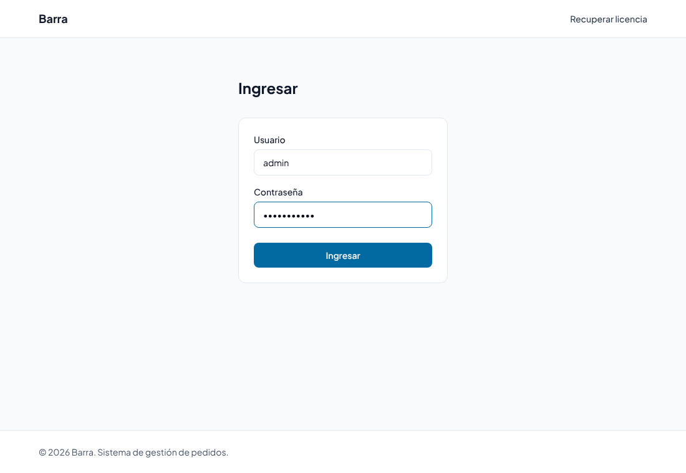
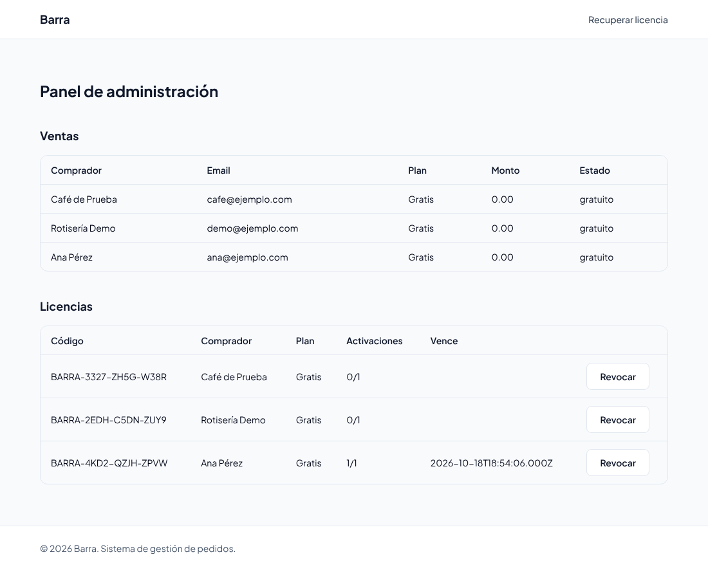

# Manual del panel de administración de la web

Guía para el **equipo de Barra** (quien vende el sistema). El panel muestra las ventas y las
licencias emitidas y permite revocar licencias. No es para los locales: ellos usan el
[manual de usuario](../manual-de-usuario.md).

---

## 1. Entrar

1. Abrí `https://<dominio>/admin` (en desarrollo, `http://localhost:5173/admin`). El panel no tiene un link en la web: hay que escribir la dirección.
2. Escribí el **usuario** y la **contraseña** y tocá **Ingresar**.



- El usuario y la contraseña son los de `ADMIN_USER` y `ADMIN_PASSWORD` en el `.env` del backend
  (ver [despliegue](despliegue-web.md#3-variables-de-entorno-del-backend)). Hay un único usuario.
- Si son incorrectos aparece «Usuario o contraseña incorrectos».
- **Para salir**, cerrá la pestaña: la sesión no se guarda y al volver hay que ingresar de nuevo.
- **Cambiar la contraseña:** editar `ADMIN_PASSWORD` en el `.env` y reiniciar el backend.

## 2. El panel



### Ventas

Una fila por compra, la más nueva arriba.

| Columna | Qué indica |
|---|---|
| Comprador / Email | Datos que cargó quien compró |
| Plan | Gratis, Pro o Max |
| Monto | Lo cobrado en pesos (0.00 en el plan Gratis) |
| Estado | `gratuito` (plan Gratis), `pendiente` (fue a pagar y Mercado Pago todavía no confirmó), `aprobado` (pagó y se emitió la licencia) o `rechazado` |

> Un pago queda **pendiente** si el comprador abandonó el pago o si Mercado Pago todavía no avisó.
> La licencia se emite recién cuando el pago pasa a **aprobado**.

### Licencias

Una fila por licencia emitida.

| Columna | Qué indica |
|---|---|
| Código | El código `BARRA-XXXX-XXXX-XXXX` que recibió el comprador. La clave secreta no se muestra: solo se guarda su hash |
| Comprador / Plan | A quién y con qué plan se emitió |
| Activaciones | Usadas / máximo. «0/1» = todavía no se activó; «1/1» = activada |
| Vence | Fecha y hora de vencimiento, en UTC. Vacía si todavía no se activó: el plazo corre desde la activación |

## 3. Revocar una licencia

Sirve para dar de baja una licencia (por ejemplo, un reintegro o un uso indebido).

1. Buscá la licencia por su código o por el comprador.
2. Tocá **Revocar**.

- La licencia queda con **0 activaciones disponibles**: ya no se puede activar y su estado pasa a «no válida».
- **No pide confirmación y no se puede deshacer desde el panel.** Para revertirla hay que hacerlo
  en la base de datos:

  ```sql
  UPDATE licencias SET max_activaciones = 1 WHERE codigo = 'BARRA-XXXX-XXXX-XXXX';
  ```

> **Esta versión:** como la app de escritorio todavía no valida licencias, revocar no bloquea un
> Barra ya instalado. Va a tener efecto cuando la app implemente la activación (RF20).

## 4. Situaciones frecuentes

| Situación | Qué hacer |
|---|---|
| Un cliente perdió el **código** | Que use **Recuperar licencia** en la web: le llega el código al email de compra |
| Un cliente perdió la **clave secreta** | No se puede recuperar (solo se guarda el hash). Hoy no hay forma de emitir una licencia nueva desde el panel: el cliente puede volver a obtener el plan Gratis, o se carga a mano en la base |
| Un pago quedó **pendiente** mucho tiempo | Buscar el pago en la cuenta de Mercado Pago. Si se aprobó y el webhook no llegó, revisar la configuración del webhook y `MP_WEBHOOK_SECRET` |
| No llegan los mails de licencia | Revisar `SMTP_HOST`, `SMTP_USER` y `SMTP_PASS`. Sin `SMTP_HOST`, los mails solo se imprimen en la consola del backend |
| Dice «Usuario o contraseña incorrectos» con los datos correctos, o el panel aparece vacío aunque hubo ventas | El panel muestra ese mismo mensaje si el backend no responde. Verificar que `/api/health` responde y que la base está arriba |

## 5. Limitaciones conocidas

- Un mismo email puede obtener el plan **Gratis** todas las veces que quiera: no hay control de
  pruebas repetidas.
- No hay búsqueda, filtros ni paginación: con muchas ventas, usar Ctrl+F del navegador.
- La columna «Vence» muestra la fecha en formato técnico (ISO, en UTC).
- No se puede emitir una licencia manual ni reenviar el mail de licencia desde el panel.
